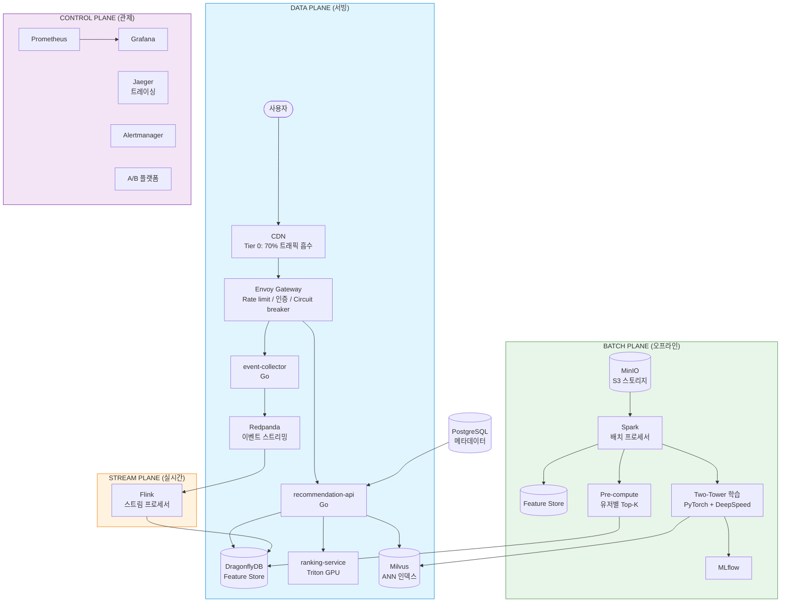
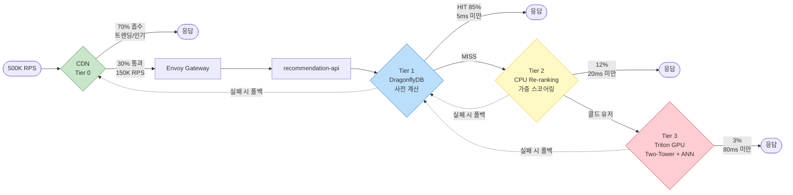
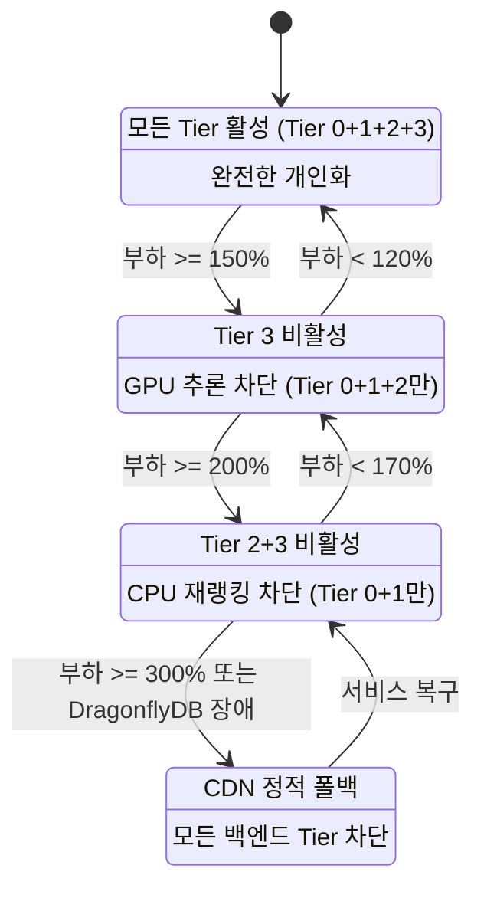
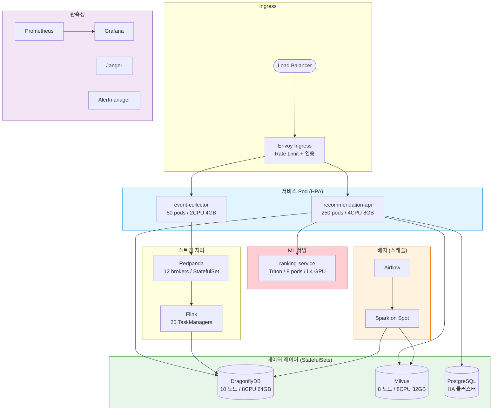

# recsys-pipeline

[English README](README.md)

50M DAU 커머스 서비스를 위한 프로덕션 수준의 추천 시스템 파이프라인.

`docker-compose up` 한 번으로 로컬 실행 가능하고, Kubernetes에서 500K RPS까지 확장되는 클라우드 애그노스틱 레퍼런스 아키텍처.

---

## 목차

- [이 프로젝트가 하는 일](#이-프로젝트가-하는-일)
- [왜 이 프로젝트인가?](#왜-이-프로젝트인가)
- [아키텍처](#아키텍처)
- [컴포넌트 아키텍처](#컴포넌트-아키텍처)
  - [Envoy Gateway](#envoy-gateway--트래픽-게이트) · [Event Collector](#event-collector--이벤트-수집) · [Redpanda](#redpanda--이벤트-스트리밍-백본) · [Stream Processor](#stream-processor--실시간-피처-엔진-apache-flink) · [DragonflyDB](#dragonflydb--통합-피처-스토어) · [Milvus](#milvus--벡터-유사도-검색) · [Recommendation API](#recommendation-api--오케스트레이터) · [Ranking Service / Triton](#ranking-service--triton--gpu-추론) · [Batch Processor](#batch-processor--오프라인-인텔리전스-pyspark--airflow) · [PostgreSQL](#postgresql--메타데이터-저장소) · [MinIO](#minio--오브젝트-스토리지) · [모니터링 스택](#모니터링-스택--관측성-레이어)
  - [전체 데이터 흐름](#전체-데이터-흐름-end-to-end)
- [3-Tier 서빙 전략](#3-tier-서빙-전략)
- [프로젝트 구조](#프로젝트-구조)
- [기술 스택](#기술-스택)
- [아키텍처 의사결정](#아키텍처-의사결정)
- [기술 스택 선정 근거](#기술-스택-선정-근거)
- [핵심 설계 결정](#핵심-설계-결정)
- [아키텍처 고려사항](#아키텍처-고려사항)
  - [CDN API 응답 캐싱](#1-cdn은-정적-파일-전용이-아니다--api-응답-캐싱) · [타임아웃 예산](#2-타임아웃-예산-전략) · [커넥션 풀](#3-커넥션-풀-사이징) · [파티션 키](#4-파티션-키-전략) · [장애 모드](#5-장애-모드-분석) · [일관성 모델](#6-데이터-일관성-모델) · [콜드 스타트](#7-콜드-스타트-처리) · [캐시 무효화](#8-캐시-무효화-전략) · [백프레셔](#9-백프레셔-처리) · [메모리 예산](#10-메모리-예산-계산) · [멱등성](#11-순서-보장--멱등성) · [보안](#12-보안-고려사항) · [정상 종료](#13-정상-종료--무중단-배포) · [관측성 기반 Degradation](#14-관측성-기반-degradation)
- [추천 전략 상세 분석](#추천-전략-상세-분석)
- [데이터 아키텍처 & 성능 고려사항](#데이터-아키텍처--성능-고려사항)
- [빠른 시작](#빠른-시작)
- [성능 검증 결과](#성능-검증-결과)
- [프로덕션 배포](#프로덕션-배포)
- [로드맵](#로드맵)
- [라이선스](#라이선스)

---

## 이 프로젝트가 하는 일

대규모 이커머스를 위한 <strong>개인화 상품 추천 시스템</strong>입니다. 유저가 앱을 열면, 이 시스템이 유저의 탐색 이력, 구매 패턴, 실시간 세션 행동을 기반으로 어떤 상품을 보여줄지 결정합니다.

### 해결하는 문제

유저가 커머스 앱을 열었습니다. 앱에는 100만 개의 상품이 있습니다. 랜덤 상품을 보여주면 유저는 이탈합니다. 모든 유저에게 동일한 "Top 10"을 보여주면 약간 낫지만, 5천만 유저는 5천만 가지 취향을 가지고 있습니다. 시스템이 답해야 할 질문:

> **"100만 개 상품 중, 이 특정 유저에게 지금 보여줄 20개는?"**

...그것도 100ms 이내에, 초당 50만 번, GPU 비용으로 파산하지 않으면서.

### 추천 방식

YouTube, Pinterest, Alibaba의 프로덕션 시스템에서 영감받은 <strong>3단계 접근법</strong>을 사용합니다:

```
1단계: 후보 생성 (오프라인, 배치)
────────────────────────────────
  "100만 상품에서 이 유저의 후보 100개로 좁히기"

  Two-Tower 신경망이 유저/아이템 임베딩(128차원 벡터)을 학습.
  유저 임베딩을 모든 아이템 임베딩과 ANN 검색으로 비교 (Milvus).
  결과: 유저당 가장 관련 높은 100개 아이템, 4시간마다 사전 계산.

2단계: 재랭킹 (온라인, 실시간)
────────────────────────────────
  "100개 후보에서 이 유저가 방금 한 행동 기반으로 재정렬"

  세션 이벤트(최근 50개 클릭/조회)로 아이템 점수 조정:
  - 이미 클릭한 아이템: 감점 (같은 것을 다시 보여주지 않기)
  - 이미 조회한 아이템: 약한 감점
  - 다양한 카테고리의 아이템: 가점
  결과: 세션 내에서 적응하는 맥락 인식 정렬.

3단계: 스코어링 (온라인, GPU 추론 — 콜드 스타트 전용)
──────────────────────────────────────────────────
  "이력이 없는 신규 유저에게 랭킹 모델로 후보 스코어링"

  DCN-V2 (Deep & Cross Network v2)가 각 후보를 스코어링:
  - 유저 임베딩 (128차원)
  - 아이템 임베딩 (128차원)
  - 컨텍스트 피처 (32차원: 기기, 시간, 세션 길이)
  결과: 시스템이 아무것도 모르는 유저를 위한 ML 랭킹 리스트.
```

### 이 프로젝트가 다른 점

대부분의 추천 시스템 튜토리얼은 <strong>한 조각</strong>만 보여줍니다 — Jupyter 노트북의 협업 필터링 모델이나 하드코딩된 아이템을 반환하는 REST API. 이 프로젝트는 <strong>전체 기계</strong>입니다:

| 레이어 | 포함된 것 | 대부분의 데모가 생략하는 것 |
|--------|----------|------------------------|
| **이벤트 수집** | HTTP 수집기 → Redpanda (Kafka 호환) | 이벤트 스키마, 파티셔닝, 백프레셔 |
| **스트림 처리** | 실시간 피처용 Flink 잡 | 세션 추적, 슬라이딩 윈도우, 재고 비트맵 |
| **배치 파이프라인** | PySpark 피처 + Airflow 스케줄링 | 대규모 피처 엔지니어링, 증분 갱신 |
| **ML 모델** | Two-Tower 검색 + DCN-V2 랭킹 (PyTorch) | 학습 파이프라인, ONNX 내보내기, 임베딩 생성 |
| **벡터 검색** | Milvus ANN 인덱스로 후보 검색 | 인덱스 구축, 배치 사전 계산 |
| **서빙 API** | 내장 로직의 멀티 티어 Go API | 정상 degradation, circuit breaker, A/B 테스트 |
| **GPU 추론** | Triton Inference Server (gRPC) | 동적 배칭, INT8 양자화, 타임아웃 처리 |
| **재고 필터링** | 실시간 재고 비트맵 (아이템당 O(1)) | 품절 상품을 절대 추천하지 않음 |
| **실험 라우팅** | A/B 테스트용 FNV-1a 일관된 해싱 | 결정적 버킷 할당, 트래픽 분할 |
| **인프라** | Docker Compose (로컬) + Helm (K8s 프로덕션) | Envoy 게이트웨이, Prometheus/Grafana, 카오스 테스트 |

### 대상 독자

- **백엔드/ML 엔지니어**: 추천 시스템이 대규모에서 end-to-end로 어떻게 동작하는지 학습
- **시스템 아키텍트**: 실시간 개인화를 위한 기술 선택 평가
- **엔지니어링 팀**: 자체 커머스 플랫폼에 적용할 레퍼런스 아키텍처
- **면접 준비**: "노트북에서 모델 학습했습니다" 수준을 넘어 ML 인프라에 대한 깊은 이해를 보여주고 싶은 분

이것은 드래그 앤 드롭 SaaS 제품이 **아닙니다**. 학습하고, 포크하고, 적용하기 위한 레퍼런스 구현입니다.

---

## 왜 이 프로젝트인가?

수천만 사용자를 위한 개인화 엔진을 구축하는 것은 커머스 분야에서 가장 어려운 엔지니어링 과제 중 하나입니다. 대부분의 오픈소스 예제는 토이 데모이거나 독점적인 단편에 불과합니다. 이 프로젝트는 이벤트 수집부터 모델 서빙까지 — 실제 프로덕션 트래픽을 처리할 수 있도록 설계된 <strong>완전하고 실행 가능한 파이프라인</strong>을 제공합니다.

### 핵심 설계 철학

**1. 가능한 모든 것을 사전 계산하고, 필요할 때만 온디맨드로 계산한다.**

500K RPS에서 모든 요청에 신경망을 실행하면 500+ GPU가 필요합니다 ($300K+/월). 대신 85% 유저의 추천을 오프라인에서 사전 계산하여 캐시에서 3-5ms에 제공하고, 진정으로 필요한 0.9% 요청(콜드 스타트 유저, A/B 테스트 변형)에만 GPU 추론을 예약합니다.

**2. 정상적으로 degradation하되, 조용히 실패하지 않는다.**

시스템에는 4단계 degradation 레벨이 있습니다. 극심한 부하에서 비용이 높은 티어를 점진적으로 비활성화(GPU → 세션 재랭킹 → 캐시)하지만 항상 무언가를 반환합니다 — 글로벌 인기 상품 목록뿐이더라도. 유저는 절대 빈 화면을 보지 않습니다.

**3. Fan-out하지 말고, 내장(embed)한다.**

전통적인 마이크로서비스 아키텍처는 요청당 5+ 서비스로 fan-out하여 (피처 스토어, 후보 생성기, 랭커, 필터, 실험 라우터) 10+ 네트워크 홉을 추가합니다. 이 프로젝트는 모든 서빙 로직을 단일 Go 바이너리에 내장하여 p99를 ~57ms에서 ~15ms로 줄입니다.

**50M DAU 기준 핵심 수치:**

| 지표 | 값 |
|------|-----|
| 피크 RPS | 500K (70%는 CDN 흡수, 150K가 백엔드 도달) |
| p99 지연시간 | 전체 < 100ms, Tier 1 캐시 히트 < 5ms |
| 캐시 히트율 | 개인화 요청의 85%가 사전 계산 캐시에서 서빙 |
| GPU 추론 | ~4.5K RPS (트래픽의 0.9%), NVIDIA L4 GPU 8대 |
| 예상 월 비용 | ~$84K (~1.18억 원), 기존 아키텍처 대비 71% 저렴 |
| 카탈로그 규모 | 100만 상품, 10만 카테고리 |
| 추천 신선도 | 4시간 증분, 24시간 전체 재계산 |

### 실제 동작 모습

```
# 1. 모든 서비스 로컬 시작
make up

# 2. 10,000개 아이템과 1,000명 유저를 현실적 선호도와 함께 생성
make seed-data

# 3. 트래픽 생성 (클릭, 조회, 구매)
make simulate-traffic

# 4. 추천 요청
curl "http://localhost:8090/api/v1/recommend?user_id=u_00001&session_id=sess_001&limit=5"

# 응답:
{
  "items": [
    {"item_id": "i_004217", "score": 0.97, "category": "electronics"},
    {"item_id": "i_001832", "score": 0.94, "category": "electronics"},
    {"item_id": "i_007291", "score": 0.91, "category": "gaming"},
    {"item_id": "i_000482", "score": 0.88, "category": "electronics"},
    {"item_id": "i_003119", "score": 0.85, "category": "audio"}
  ],
  "tier": "tier2_rerank",
  "experiment_id": "exp_v2",
  "model_version": "dcn_v2_20240315"
}
```

응답이 알려주는 것: 이 5개 아이템은 유저의 사전 계산 캐시에서 가져온 후 (Tier 1), 세션 행동으로 재랭킹되었고 (Tier 2), 유저는 실험 그룹 `exp_v2`에 속합니다.

---

## 아키텍처

### 1. 시스템 아키텍처 (전체 구성)

각 Plane이 독립적으로 확장되는 **4-Plane** 모델을 따릅니다.



### 2. 3-Tier 추천 흐름

대부분의 사용자에게는 사전 계산된 결과를 제공하고, 캐시 미스 시에만 실시간 추론을 실행합니다.



### 3. 데이터 파이프라인 흐름


### 4. Degradation 상태 머신

시스템은 절대 빈 화면을 보여주지 않습니다. 각 단계에서 가장 비싼 Tier부터 차단하여 핵심 서빙을 보호합니다.



### 5. 배포 아키텍처 (Kubernetes)



---

## 컴포넌트 아키텍처

각 컴포넌트가 존재하는 이유, 어떤 역할을 하는지, 내부적으로 어떻게 동작하는지 설명합니다.

### Envoy Gateway — 트래픽 게이트

**왜 필요한가:** 모든 백엔드를 과부하로부터 보호하는 단일 진입점. 없으면 트래픽 스파이크가 모든 서비스에 동시에 전파됩니다.

**동작 방식:**
- 포트 10000에서 수신, URL 경로 기반으로 event-collector 또는 recommendation-api로 라우팅
- 토큰 버킷 rate limiter: 초당 10,000 토큰 — 초과 요청은 백엔드 도달 전 HTTP 429 응답
- 클러스터별 circuit breaker: 백엔드당 최대 1024 연결, 1024 동시 요청
- 5초 연결 타임아웃으로 느린 백엔드가 연결을 점유하는 것을 방지

```
인터넷 → Envoy (:10000)
           ├─ /api/v1/events     → event-collector:8080
           ├─ /api/v1/recommend  → recommendation-api:8090
           └─ /api/v1/popular    → recommendation-api:8090
```

**프로덕션 규모:** 10개 파드, 각 2 CPU / 2GB. Envoy의 C++ 스레드 모델로 파드당 ~50K 동시 연결 처리.

---

### Event Collector — 이벤트 수집

**왜 필요한가:** 이벤트 생산자(클라이언트 앱)와 소비자(스트림 프로세서, 배치 파이프라인)를 분리합니다. HTTP를 받아 검증 후 Redpanda에 발행 — 클라이언트가 메시지 브로커에 직접 접근하지 않습니다.

**동작 방식:**

```
POST /api/v1/events
  { "event_type": "click", "user_id": "u_001", "item_id": "i_042" }
         │
         ▼
  ┌─ 검증 ─────────────────────────────────────────┐
  │  event_type ∈ {click, view, purchase, search,   │
  │                add_to_cart, remove_from_cart}     │
  │  user_id 필수, item_id 필수                       │
  └─────────────────────────────────────────────────┘
         │
         ▼
  ┌─ 보강 ─────────────────────────────────────────┐
  │  event_id = UUID v4 (서버 생성)                   │
  │  timestamp = time.Now().UTC()                     │
  └─────────────────────────────────────────────────┘
         │
         ▼
  ┌─ 발행 ─────────────────────────────────────────┐
  │  Redpanda 토픽: user-events                      │
  │  파티션 키: user_id (유저별 순서 보장)              │
  │  배치: 최대 1MB, 5ms linger                       │
  │  전달: 비동기 fire-and-forget                      │
  └─────────────────────────────────────────────────┘
         │
         ▼
  HTTP 202 Accepted { "event_id": "...", "status": "accepted" }
```

**핵심 설계:**
- **파티션 키 = user_id**: 유저별 이벤트 순서 보장 (클릭 → 구매 순서 역전 방지)
- **비동기 발행**: Redpanda 확인 전 HTTP 응답 반환. 처리량 극대화 (단일 인스턴스 2,700 RPS), 드문 브로커 장애 시 최대 1회 전달 손실
- **서버 생성 event_id**: 클라이언트가 UUID 생성 불필요, 연동 복잡도 감소

**프로덕션 규모:** 50개 파드, 각 2 CPU / 4GB. 피크 시 HPA로 200개까지 확장.

---

### Redpanda — 이벤트 스트리밍 백본

**왜 필요한가:** 실시간 이벤트 수집과 다운스트림 소비자 사이의 다리. Kafka 호환 프로토콜로 기존 모든 Kafka 도구 사용 가능, C++ thread-per-core로 JVM GC 중단 없이 일관된 p99 레이턴시 보장.

**동작 방식:**
- **토픽 `user-events`**: user_id로 파티셔닝. Event collector가 발행, 스트림 프로세서와 배치 파이프라인이 소비
- **토픽 `inventory-events`**: item_id로 파티셔닝. 재고 시스템이 발행, 스트림 프로세서가 비트맵 업데이트용으로 소비
- **Dev 모드**: 단일 브로커, SMP=1, 1GB 메모리. ZooKeeper/KRaft 없이 자체 완결형
- **보존**: 이벤트 로그는 배치 재처리를 위해 MinIO(S3)에도 아카이빙

**왜 Kafka가 아닌가:** 50M DAU에서 Kafka는 ~50 브로커 필요 ($25K/월) vs Redpanda ~12 브로커 ($6K/월). C++ thread-per-core 모델로 노드당 4배 처리량, 결정적 p99 레이턴시 (<5ms vs Kafka GC 중 10-50ms).

**프로덕션 규모:** 12 브로커, 각 8 CPU / 32GB. 내구성을 위한 복제 팩터 3.

---

### Stream Processor — 실시간 피처 엔진 (Apache Flink)

**왜 필요한가:** 원시 이벤트를 서빙 레이어가 실시간으로 사용할 수 있는 피처로 변환합니다. 이것 없이는 모든 피처가 시간 단위로 stale합니다 (배치 전용). 스트림 프로세서가 "이 유저가 지난 1시간에 뭘 했는지?"를 밀리초 내에 답할 수 있게 합니다.

**동작 방식 — 3개 병렬 브랜치:**

```
Redpanda: user-events
    │
    ├─── 브랜치 1: 클릭 집계 ───────────────────────────────────
    │    keyBy(user_id) → SlidingWindow(1시간, 1분) → 클릭 수 집계
    │    출력: DragonflyDB SET feat:user:{uid}:clicks_1h {count}
    │          TTL: 3660초 (1시간 + 1분 버퍼)
    │
    ├─── 브랜치 2: 세션 버퍼 ────────────────────────────────────
    │    keyBy(session_id) → 상태 유지 KeyedProcessFunction
    │    이벤트마다: ZADD session:{sid}:events {timestamp} {json}
    │    출력: DragonflyDB ZSET (최근 이벤트 유지, TTL 30분)
    │
Redpanda: inventory-events
    │
    └─── 브랜치 3: 재고 비트맵 ──────────────────────────────────
         keyBy(item_id) → 비트맵 오프셋 해싱
         재고 변경마다:
           SETBIT stock:bitmap {offset} {0|1}
           SET stock:id_map:{item_id} {offset}
         출력: DragonflyDB BITMAP (O(1) 재고 확인)
```

**핵심 설계:**
- **슬라이딩 윈도우** (텀블링 아님): 텀블링 1시간 윈도우는 매시간 0으로 리셋됨. 1분 슬라이드의 1시간 슬라이딩 윈도우는 "최근 60분간 클릭 수"를 지속적으로 업데이트
- **세션 키잉**: user_id가 아닌 session_id로 그룹화. 유저가 여러 세션 동시 사용 가능 (모바일 + 데스크톱)
- **재고용 비트맵**: 전통적 접근은 아이템마다 DB 쿼리. 비트맵은 100만 아이템을 125KB로 압축, O(1) 재고 확인 가능

**프로덕션 규모:** Flink TaskManager 25개, 각 4 CPU / 8GB. exactly-once 보장을 위해 MinIO로 체크포인팅.

---

### DragonflyDB — 통합 피처 스토어

**왜 필요한가:** 모든 컴포넌트가 빠른 읽기를 필요로 합니다. recommendation-api가 캐시된 추천, 세션 이벤트, 재고 비트맵, 실험 설정을 모두 한 곳에서 읽습니다. DragonflyDB의 멀티스레드 shared-nothing 아키텍처가 노드당 500-800K ops/s를 달성 (Redis의 100K 대비), 클러스터를 100노드에서 10노드로 축소.

**동작 방식:**
- **Redis 호환 프로토콜**: 모든 Go Redis 클라이언트(go-redis) 변경 없이 사용. 드롭인 대체
- **멀티스레드**: 단일 스레드 Redis와 달리 shared-nothing 아키텍처로 모든 CPU 코어 활용
- **Dash 해시 테이블**: 동일 데이터에 대해 Redis 해시 테이블보다 30% 적은 메모리 사용

| 타입 | 키 패턴 | 사용 주체 | 접근 패턴 |
|------|---------|----------|----------|
| STRING (JSON) | `rec:{uid}:top_k` | 배치 → Rec API | 1회 쓰기, 다수 읽기 |
| STRING (JSON) | `rec:popular:top_k` | 배치 → Rec API / CDN | 1회 쓰기, 브로드캐스트 읽기 |
| BITMAP | `stock:bitmap` | Flink → Rec API | 지속 쓰기, 빈번 읽기 |
| ZSET | `session:{sid}:events` | Flink → Rec API | 추가 쓰기, 범위 읽기 |
| SET | `experiment:active` | 관리자 → Rec API | 드문 쓰기, 빈번 읽기 |
| INT | `feat:user:{uid}:clicks_1h` | Flink → (향후) Rec API | 지속 쓰기, 스코어링 시 읽기 |

**프로덕션 규모:** 10노드, 각 8 CPU / 64GB. 총 ~4M ops/s 용량.

---

### Milvus — 벡터 유사도 검색

**왜 필요한가:** 유저 임베딩(128차원 벡터)이 주어지면 수백만 아이템 임베딩 중 가장 유사한 100개를 찾습니다. Two-Tower 검색 모델의 핵심. 100만 아이템 brute-force 비교는 ~50ms이지만 Milvus의 HNSW 인덱스는 <5ms에 수행.

**동작 방식:**
- **컬렉션 `item_embeddings`**: Two-Tower 모델의 아이템 타워가 생성한 128차원 아이템 벡터 저장
- **인덱스 HNSW**: 다층 그래프에서 각 노드가 최근접 이웃과 연결. 상위 레이어(대략적)에서 하위 레이어(정밀)로 탐색
- **배치 파이프라인이 사용**: 각 유저에 대해 `Milvus.search(user_embedding, top_k=100)` 호출, 결과를 DragonflyDB에 캐시

**왜 서빙 시점에 사용하지 않는가:** 150K RPS에서의 ANN 검색은 Milvus의 대규모 확장이 필요. 대신 결과를 사전 계산하고 캐시. Milvus는 배치 파이프라인(일간/4시간)에서만 쿼리.

**프로덕션 규모:** 8노드, 각 8 CPU / 32GB. HNSW 또는 IVF_FLAT 인덱스로 10억 스케일 벡터 지원.

---

### Recommendation API — 오케스트레이터

**왜 필요한가:** 모든 것을 하나로 묶는 중앙 두뇌. 5+ 마이크로서비스(피처 스토어, 후보 생성, 랭커, 필터, 실험 라우터)로 fan-out하는 대신 단일 Go 바이너리에 모든 로직을 내장. 4+ 네트워크 홉 제거로 p99를 ~57ms에서 ~15ms로 단축.

**3개 엔드포인트:**

| 엔드포인트 | 목적 | SLA |
|-----------|------|-----|
| `GET /api/v1/recommend` | 개인화 추천 | <100ms p99 |
| `GET /api/v1/popular` | 글로벌 인기 상품 (CDN 캐시 가능) | <5ms |
| `GET /health` | DragonflyDB 연결 상태 확인 | <2s |

**내장 컴포넌트 (상호 간 네트워크 호출 없음):**

```
recommendation-api 바이너리
  ├── DragonflyStore         — 캐시 읽기/쓰기 (추천, 인기)
  ├── BitmapChecker          — 비트맵 기반 재고 확인
  ├── SessionFeatureExtractor — ZSET에서 세션 이벤트 읽기
  ├── WeightedScorer         — 세션 기반 점수 조정
  ├── SessionReranker        — 추출 → 스코어링 → 정렬 오케스트레이션
  ├── ProtectedRanker        — Triton gRPC + circuit breaker
  ├── DegradationManager     — 4단계 부하 분산 상태 머신
  ├── ExperimentRouter       — A/B용 FNV-1a 일관된 해싱
  ├── TierRouter             — 멀티 티어 캐스케이드 오케스트레이터
  └── Prometheus metrics     — 티어별 카운터, 히스토그램, 게이지
```

**Degradation 상태 머신** — API는 절대 빈 응답을 반환하지 않음:

```
Normal    (부하 < 1.5배)  →  모든 티어 활성
Warning   (부하 ≥ 1.5배)  →  Tier 3 (GPU) 비활성
Critical  (부하 ≥ 2.0배)  →  Tier 2 + 3 비활성
Emergency (부하 ≥ 3.0배)  →  CDN 폴백 전용 (인기 상품)
```

**프로덕션 규모:** 250개 파드, 각 4 CPU / 8GB. 피크 시 HPA로 1,000까지 확장. 파드당 ~1,050 RPS (벤치마크 검증됨).

---

### Ranking Service / Triton — GPU 추론

**왜 필요한가:** 콜드 스타트 유저(캐시된 추천 없음)는 실시간 개인화가 필요합니다. DCN-V2 모델이 유저/아이템 임베딩과 컨텍스트 피처를 기반으로 후보 아이템을 스코어링합니다. Triton의 동적 배칭이 개별 요청을 GPU 배치로 그룹화하여 효율적 활용.

**동작 방식:**

```
ProtectedRanker.Rank(userID, candidates)
        │
        ▼
  CircuitBreaker.Allow()?
  ├── Open (30초 내 5회+ 실패) → 즉시 에러 반환
  └── Closed/HalfOpen → 진행
        │
        ▼
  BatchItem[] 구성
  ├── UserEmbedding:   128차원 (피처 스토어에서)
  ├── ItemEmbedding:   128차원 (피처 스토어에서)
  └── ContextFeatures: 32차원 (세션 컨텍스트)
        │
        ▼
  Triton gRPC: ModelInfer(dcn_v2, batch)
  ├── 동적 배칭: 32/64/128 선호 배치 크기
  ├── TensorRT INT8 양자화: FP32 대비 3배 처리량
  └── 타임아웃: 80ms (context deadline)
        │
        ▼
  점수 내림차순 정렬
  랭킹된 리스트 반환
```

**Circuit breaker 상태:**
- **Closed** (정상): 모든 요청 통과. 실패 시 카운터 증가
- **Open** (5회 실패 후): 모든 요청 즉시 에러로 거부. 타이머 시작 (30초)
- **Half-Open** (30초 후): 요청 1건 허용. 성공 → Closed. 실패 → Open

**왜 전체 트래픽의 0.9%만 Tier 3에 도달하는가:** 3-Tier 전략이 85% 유저의 추천을 사전 계산 (Tier 1 캐시 히트). 세션 재랭킹이 12% 처리. 콜드 스타트/실험 유저만 GPU 추론. GPU 비용을 $60K/월(전체 GPU)에서 $4.8K/월로 절감.

**프로덕션 규모:** 8개 파드, 4 CPU / 16GB + NVIDIA L4 GPU 1개씩. HPA로 32개까지 확장.

---

### Batch Processor — 오프라인 인텔리전스 (PySpark + Airflow)

**왜 필요한가:** ML 모델 학습과 5천만 유저의 추천 사전 계산은 실시간으로 불가능합니다. 배치 프로세서가 비피크 시간에 저렴한 스팟 인스턴스에서 실행하여, 요청당 계산하기에는 비용이 너무 높은 피처를 생성합니다.

**동작 방식 — 4단계:**

```
1단계: 피처 엔지니어링 (PySpark)
────────────────────────────────
원시 이벤트 (PostgreSQL/MinIO)
  ↓ groupBy(user_id)
  ├── total_clicks, total_views, total_purchases
  ├── category_interests (상호작용한 카테고리 셋)
  └── total_events
  ↓ groupBy(item_id)
  ├── click_count, purchase_count
  ├── ctr = clicks / max(views, 1)
  └── unique_users

2단계: 모델 학습 (PyTorch + DeepSpeed)
──────────────────────────────────────
피처 + 라벨 → Two-Tower 모델 학습
  ├── User tower: user_id(64d) + categories(32d) → MLP → 128d 임베딩
  └── Item tower: item_id(64d) + category(32d) + price(32d) → MLP → 128d 임베딩
피처 + 라벨 → DCN-V2 모델 학습
  └── user_emb(128d) + item_emb(128d) + context(32d) → cross network → 점수

3단계: 임베딩 생성 & 인덱싱
──────────────────────────
Item tower → 아이템 임베딩 배치 생성
  ↓ 대량 삽입
Milvus ANN 인덱스 (item_embeddings 컬렉션, 128차원, HNSW)

4단계: 추천 사전 계산
────────────────────
유저별 (배치, 1000명씩):
  user_embedding → Milvus.search(top_k=100)
  ↓ 결과
  DragonflyDB: SET rec:{user_id}:top_k {json} EX 86400
```

**스케줄링 (Airflow):**
- **일간 전체 파이프라인**: 4단계 모두. 트래픽 최저 시 새벽 3시 실행
- **4시간 증분**: 1단계(최근 이벤트만) + 4단계(업데이트된 유저만)

**프로덕션 규모:** 스팟 인스턴스 Spark (60% 비용 절감). 최소 상시 가동 노드에서 Airflow.

---

### PostgreSQL — 메타데이터 저장소

**왜 필요한가:** 관계형 데이터(아이템 카탈로그, 유저 프로필, 실험 이력)는 ACID 트랜잭션과 DragonflyDB가 제공할 수 없는 복잡한 쿼리가 필요합니다. PostgreSQL이 source of truth, DragonflyDB는 서빙 캐시.

**현재 사용:**
- Airflow 메타데이터 데이터베이스 (DAG 실행, 태스크 상태, 연결)
- 계획: 아이템 카탈로그 (이름, 설명, 가격, 카테고리, 이미지), 유저 메타데이터, 실험 결과

**구조:**

```
PostgreSQL (source of truth)
  ├── items 테이블: id, name, category, price, image_url, created_at
  ├── users 테이블: id, preferences, signup_date
  └── experiments 테이블: id, config, results, created_at
       │
       ├──→ (CDC 또는 배치 ETL) → DragonflyDB (서빙 캐시)
       └──→ (직접 쿼리) → 관리자 대시보드, 분석
```

**프로덕션 규모:** 스트리밍 복제가 있는 HA 클러스터. 핫 서빙 경로에 없음.

---

### MinIO — 오브젝트 스토리지

**왜 필요한가:** 이벤트 로그, 모델 아티팩트, 학습 데이터는 내구성 있고 저렴한 스토리지가 필요합니다. MinIO는 어디서든 실행 가능한 S3 호환 오브젝트 스토리지 — 온프레미스든 클라우드든 벤더 종속 없음.

**저장 내용:**
- 원시 이벤트 로그 (Redpanda에서 아카이빙)
- 모델 체크포인트 (PyTorch .pt 파일)
- ONNX 내보내기 모델 (Triton 배포용)
- 학습 데이터셋 (피처 매트릭스)
- Spark 중간 데이터

---

### 모니터링 스택 — 관측성 레이어

**왜 필요한가:** 50M DAU에서 로그 읽기로 디버깅은 불가능합니다. 모니터링 스택이 모든 컴포넌트의 상태를 실시간 가시화하고, 자동 알림이 degradation 상태 머신을 트리거합니다.

```
┌─ Prometheus ────────────────────────────────────────────────┐
│  15초마다 메트릭 수집:                                        │
│  ├── event-collector:2112  (요청, 에러, 레이턴시)             │
│  ├── recommendation-api:2112 (티어별 메트릭, CB 상태)        │
│  ├── redpanda:9644 (파티션 랙, 브로커 상태)                  │
│  └── dragonfly:6380 (메모리, 제거율, 커맨드 레이턴시)         │
│  저장: 7일 TSDB 보존                                         │
└──────────────────────┬──────────────────────────────────────┘
                       │
         ┌─────────────┼─────────────┐
         ▼             ▼             ▼
┌─ Grafana ──┐ ┌─ Alertmanager ┐ ┌─ Jaeger ────────────┐
│ 대시보드    │ │ 알림 라우팅    │ │ 분산 트레이싱       │
│ 티어별     │ │ PagerDuty/    │ │ OTLP 수집기        │
│ 레이턴시,  │ │ Slack/Email   │ │ 서비스간 요청       │
│ 처리량     │ │ 연동          │ │ 워터폴             │
└────────────┘ └───────────────┘ └─────────────────────┘
```

**recommendation-api가 노출하는 커스텀 메트릭:**

| 메트릭 | 타입 | 라벨 | 목적 |
|--------|------|------|------|
| `recsys_requests_total` | Counter | tier | 티어별 트래픽 분포 추적 |
| `recsys_request_duration_seconds` | Histogram | tier | 티어별 레이턴시 (버킷: 1/5/10/20/50/100ms) |
| `recsys_errors_total` | Counter | tier | 티어별 에러율 |
| `recsys_circuit_breaker_state` | Gauge | tier | 0=closed, 1=open, 2=half-open |

---

### 전체 데이터 흐름 (End-to-End)

하나의 유저 상호작용이 전체 시스템을 관통하는 흐름:

```
1. 유저가 앱에서 아이템 클릭
        │
        ▼
2. POST /api/v1/events → Envoy → Event Collector
   검증, event_id 할당, Redpanda에 발행
        │
        ▼
3. Redpanda: user-events 토픽 (파티션 키 = user_id)
        │
        ├──────────────────────────────┐
        ▼                              ▼
4. Flink 스트림 프로세서           5. MinIO (아카이빙)
   ├── clicks_1h 카운터 업데이트       │
   ├── 세션 이벤트 추가                 ▼
   └── (재고 이벤트면)             6. Spark 배치 (일간)
       비트맵 업데이트                  ├── 피처 엔지니어링
        │                              ├── 모델 학습
        ▼                              ├── 임베딩 생성
   DragonflyDB (피처)                 └── 추천 사전 계산
                                           │
                                           ▼
                                       DragonflyDB (추천)
                                       Milvus (ANN 인덱스)
                                           │
7. 유저가 추천 요청                         │
        │                                  │
        ▼                                  │
8. GET /api/v1/recommend → Envoy → Recommendation API
   ├── DragonflyDB에서 캐시된 추천 읽기 ←──┘
   ├── 품절 필터링 (비트맵)
   ├── 세션 컨텍스트로 재랭킹 (ZSET)
   ├── (선택) Triton GPU 추론
   └── 개인화 리스트 반환
        │
        ▼
9. 유저가 추천 확인, 다른 아이템 클릭 → 1단계로 복귀
```

---

## 3-Tier 서빙 전략

핵심 인사이트: **모든 요청에 GPU 추론을 실행하지 않는다.** 대부분의 사용자에게는 사전 계산된 결과를 제공하고, 캐시 미스 시에만 실시간 추론을 실행합니다.

> 위 Tier 비율은 CDN을 통과한 150K RPS 기준입니다 (Tier 0 이후).
> 전체 500K RPS 기준: Tier 0=70%, Tier 1=25.5%, Tier 2=3.6%, Tier 3=0.9%.

---

## 프로젝트 구조

```
recsys-pipeline/
├── services/
│   ├── event-collector/          # Go — 이벤트 수집 API (Redpanda 프로듀서)
│   ├── recommendation-api/       # Go — 3-Tier 추천 서빙 (오케스트레이터)
│   ├── ranking-service/          # Python — 모델 서빙 (Triton + ONNX)
│   ├── stream-processor/         # Kotlin — Flink 실시간 Feature + 재고 비트맵
│   ├── batch-processor/          # Python — Spark Feature 엔지니어링 + 사전 계산
│   └── traffic-simulator/        # Go — 부하 테스트 + 샘플 데이터 생성
├── shared/
│   └── go/                       # 공유 Go 타입 (event, keys)
├── ml/
│   ├── models/                   # 모델 학습 코드 (Two-Tower, DCN-V2)
│   ├── notebooks/                # 실험 노트북
│   └── serving/                  # ONNX 변환 + TensorRT INT8 양자화
├── infra/
│   ├── docker-compose.yml        # 로컬 풀스택 (한 명령어)
│   ├── docker/                   # 서비스별 Dockerfile
│   ├── helm/                     # K8s Helm 차트 (dev/staging/production)
│   └── monitoring/               # Prometheus + Grafana 대시보드
├── load-tests/                   # k6 부하 테스트 시나리오
├── configs/                      # 환경별 설정
├── scripts/                      # 유틸리티 스크립트 (verify-e2e, seed data)
├── docs/                         # 아키텍처 문서
├── Makefile                      # 모든 운영 명령어
└── README.md
```

---

## 기술 스택

| 레이어 | 기술 | 용도 |
|--------|------|------|
| **API / 오케스트레이터** | Go 1.23 | event-collector, recommendation-api, traffic-simulator |
| **이벤트 스트리밍** | Redpanda | Kafka 호환, C++ thread-per-core, JVM GC 없음 |
| **캐시 / Feature Store** | DragonflyDB | Redis 호환, 멀티스레드, 5-8배 처리량 |
| **벡터 검색** | Milvus | 분산 ANN (HNSW), 십억 규모 |
| **스트림 처리** | Apache Flink | 진정한 event-at-a-time 스트리밍, 세션 윈도우 |
| **배치 처리** | Apache Spark | PB 규모 Feature 엔지니어링, 모델 학습 데이터 |
| **ML 학습** | PyTorch + DeepSpeed | Two-Tower, DCN-V2 with TorchRec |
| **모델 서빙** | NVIDIA Triton + TensorRT | 동적 배칭, INT8 양자화 |
| **API 게이트웨이** | Envoy | Adaptive concurrency, circuit breaker, 트레이싱 |
| **오브젝트 스토리지** | MinIO | S3 호환, 이벤트 로그 + 모델 아티팩트 |
| **메타데이터** | PostgreSQL | 아이템 카탈로그, 사용자 메타데이터, 실험 설정 |
| **배치 오케스트레이션** | Airflow | 일간 전체 + 4시간 증분 파이프라인 |
| **모니터링** | Prometheus + Grafana | 메트릭, 대시보드, 알림 |
| **트레이싱** | Jaeger (OTLP) | 분산 요청 트레이싱 |
| **알림** | Alertmanager | Degradation 인식 알림 라우팅 |

---

## 아키텍처 의사결정

### 왜 4-Plane 분리인가?

| 접근법 | 장점 | 단점 | 판정 |
|--------|------|------|------|
| **모놀리스** | 단순, 배포 쉬움 | 서빙/학습 리소스 경합 | 1M DAU 한계 |
| **2-Plane** (온라인/오프라인) | 서빙/학습 분리 | 실시간 Feature 없음 | 10M DAU 한계 |
| **4-Plane** (Data/Stream/Batch/Control) | Plane별 독립 확장 | 운영 복잡도 증가 | **50M DAU 필수** |

**결정:** 50M DAU에서는 서빙과 학습이 CPU/GPU/메모리를 놓고 경합합니다. 스트림 처리는 1초 미만의 Feature 신선도를 위해 독립적으로 실행되어야 합니다. 4-Plane 모델은 각 Plane이 자체 리소스 프로파일에 맞춰 오토스케일링할 수 있게 합니다 — 서빙은 CPU, 스트림은 메모리, 배치는 스팟 인스턴스, 컨트롤은 최소 상시 노드에서 확장합니다.

### 왜 3-Tier 서빙인가?

| 접근법 | GPU 사용량 | p99 지연시간 | 월 비용 |
|--------|-----------|-------------|---------|
| 전체 실시간 추론 | 500K RPS GPU | ~100ms+ | $60K+ (GPU만) |
| 사전 계산만 | GPU 0 | < 5ms | 낮지만 데이터 노후화 |
| **3-Tier 하이브리드** | 4.5K RPS (0.9%) | Tier1: 5ms, Tier3: 80ms | **$4.8K (GPU)** |

**결정:** 500K RPS 전체에 GPU 추론을 실행하면 A100 100대 이상($60K+/월)이 필요합니다. 사전 계산이 85%를 커버하고, CPU 리랭킹이 세션 컨텍스트로 12%를 처리하며, GPU는 3%의 콜드스타트/실험 트래픽에만 할당됩니다. 이를 통해 개인화 품질을 유지하면서 GPU 비용을 92% 절감합니다.

### 왜 임베디드 아키텍처 (Fan-out 제거)인가?

| 접근법 | 네트워크 홉 | p99 지연시간 | 장애 모드 |
|--------|-----------|-------------|----------|
| 마이크로서비스 fan-out | 6+ | ~57ms | 단일 서비스 장애 전파 |
| Service mesh (Istio) | 6+ (사이드카 추가) | ~70ms+ | 사이드카 오버헤드 |
| **임베디드** (직접) | 1-2 | ~15ms | DragonflyDB 단일 의존성 |

**결정:** 전통적인 추천 아키텍처는 3-5개 마이크로서비스(Feature Store, 후보 생성, 랭킹, 필터링)로 fan-out합니다. 각 홉마다 ~8-12ms 네트워크 지연이 추가됩니다. Feature 조회, 리랭킹, 필터링을 Go 오케스트레이터에 직접 임베딩함으로써 6+ 홉을 1-2번의 DragonflyDB 읽기로 축소합니다. 트레이드오프는 API 바이너리가 커지는 것이지만, Go의 컴파일 모델은 배포를 단순하게 유지합니다.

---

## 기술 스택 선정 근거

모든 기술은 명시적 비교를 거쳐 선택되었습니다. 아래는 검토된 대안, 각 장점, 그리고 최종 선택 이유입니다.

### 1. API 언어: Go

| 후보 | 처리량 (RPS/core) | p99 지연시간 | 메모리 | 바이너리 배포 | 생태계 |
|------|-------------------|-------------|--------|-------------|--------|
| **Go 1.23** | ~50K | ~2ms | ~30MB | 단일 정적 바이너리 | 강력한 인프라 생태계 |
| Rust | ~60K | ~1.5ms | ~20MB | 단일 바이너리 | 높은 학습 곡선, 느린 반복 |
| Java (Spring) | ~15K | ~10ms | ~500MB+ | JVM + JAR | 성숙하지만 GC로 인한 꼬리 지연 |
| Node.js | ~8K | ~15ms | ~100MB | 런타임 필요 | CPU 바운드 성능 취약 |

**왜 Go인가:** Rust와 비슷한 처리량을 훨씬 빠른 개발 속도로 달성합니다. 단일 바이너리 배포로 JVM/런타임 의존성을 제거합니다. Goroutine 모델은 임베디드 아키텍처(동시 DragonflyDB 읽기 + 로컬 리랭킹)에 자연스럽게 매핑됩니다. Java는 p99에서 GC로 인한 꼬리 지연 스파이크가 발생하여 Tier 1의 <5ms SLA를 위반하기 때문에 탈락했습니다.

### 2. 이벤트 스트리밍: Redpanda vs Kafka

| 기준 | Apache Kafka | **Redpanda** | Pulsar |
|------|-------------|-------------|--------|
| 언어 | Java/Scala (JVM) | C++ (thread-per-core) | Java (JVM) |
| 500K msg/s 필요 노드 | ~50 브로커 | **~12 브로커** | ~40 브로커 |
| 꼬리 지연 (p99) | 10-50ms (GC 일시정지) | **<5ms** (GC 없음) | 15-60ms |
| Kafka API 호환 | 네이티브 | **호환** | 미호환 (자체 프로토콜) |
| 운영 오버헤드 | ZooKeeper/KRaft | **자체 완결** | ZooKeeper + BookKeeper |
| 비용 (50M DAU) | ~$25K/월 | **~$6K/월** | ~$20K/월 |
| 커뮤니티/생태계 | 최대 | 빠른 성장 | 중간 |

**왜 Redpanda인가:** 동일한 API 호환성으로 Kafka 대비 76% 비용 절감. C++ thread-per-core는 p99 스파이크를 유발하는 JVM GC 일시정지를 제거합니다. 자체 완결형 배포(ZooKeeper 불필요)로 운영 복잡도를 줄입니다. 모든 Kafka 클라이언트 라이브러리(franz-go, librdkafka)가 변경 없이 동작합니다. 트레이드오프는 작은 생태계이지만, 우리의 이벤트 스트리밍 사용 사례(고처리량 수집, Flink 소비)에는 Redpanda의 기능이 충분합니다.

### 3. 캐시 / Feature Store: DragonflyDB vs Redis

| 기준 | Redis 7 | **DragonflyDB** | KeyDB | Garnet |
|------|---------|----------------|-------|--------|
| 스레딩 모델 | 싱글스레드 | **멀티스레드 (shared-nothing)** | 멀티스레드 | 멀티스레드 (.NET) |
| 노드당 처리량 (8 CPU) | ~100K ops/s | **500-800K ops/s** | ~200K ops/s | ~300K ops/s |
| 4M ops/s 필요 노드 | ~100 (클러스터) | **~10** | ~40 | ~30 |
| Redis 프로토콜 호환 | 네이티브 | **호환** | 호환 | 호환 |
| 메모리 효율 | 1x | **~0.7x (Dash hash)** | 1x | ~0.8x |
| 영속성 | RDB/AOF | 스냅샷 + WAL | RDB/AOF | RDB/AOF |
| 비용 (50M DAU) | ~$30K/월 | **~$4.5K/월** | ~$12K/월 | ~$9K/월 |

**왜 DragonflyDB인가:** Redis 클러스터 대비 85% 비용 절감. 멀티스레드 shared-nothing 아키텍처로 노드당 5-8배 처리량을 달성하여 100대 대신 10대로 충분합니다. 완전한 Redis 프로토콜 호환으로 코드 변경이 없습니다 — 모든 Go Redis 클라이언트(go-redis, rueidis)가 그대로 동작합니다. Dash hash 테이블로 30% 더 나은 메모리 효율을 제공합니다. 트레이드오프는 극한 규모에서 Redis보다 검증이 덜 되었다는 점이지만, DragonflyDB의 아키텍처는 우리 워크로드(높은 읽기 처리량, Feature Store 패턴)에 근본적으로 더 적합합니다.

### 4. 벡터 검색: Milvus vs 대안

| 기준 | **Milvus** | Qdrant | Weaviate | Pinecone |
|------|-----------|--------|----------|----------|
| 확장성 | **십억 규모 분산** | 수백만 (단일 노드 중심) | 수백만 | 관리형, 십억 |
| 인덱스 타입 | HNSW, IVF, DiskANN, GPU | HNSW | HNSW | 독점 |
| 클라우드 애그노스틱 | **자체 호스팅 가능** | 가능 | 가능 | 불가 (SaaS 전용) |
| 배치 임포트 속도 | **매우 빠름 (bulk insert)** | 보통 | 보통 | API 제한 |
| 쿼리 지연 (10M 벡터) | **<5ms (HNSW)** | <5ms | ~10ms | <10ms |
| 필터링 지원 | **속성 필터링 + ANN** | 페이로드 필터링 | GraphQL | 메타데이터 필터링 |

**왜 Milvus인가:** 1M+ 아이템의 밀집 임베딩에는 십억 규모 분산 ANN이 필요합니다. 자체 호스팅으로 클라우드 애그노스틱을 보장합니다 (Pinecone처럼 벤더 종속 없음). HNSW(낮은 지연)와 IVF_FLAT(높은 리콜) 인덱스 타입을 모두 지원합니다. Qdrant이 차점이었지만 1000만 아이템 이상의 프로덕션 카탈로그에 필요한 분산 확장이 부족합니다.

### 5. 스트림 처리: Flink vs 대안

| 기준 | **Apache Flink** | Spark Structured Streaming | Kafka Streams | Redpanda Transforms |
|------|-----------------|---------------------------|---------------|---------------------|
| 처리 모델 | **진정한 event-at-a-time** | 마이크로 배치 | 레코드 단위 | WASM 함수 |
| Exactly-once | **네이티브** | 체크포인트 기반 | 지원 | At-most-once |
| 세션 윈도우 | **네이티브 지원** | 제한적 | 커스텀 | 미지원 |
| 상태 관리 | **RocksDB, 쿼리 가능** | 인메모리 | RocksDB | 상태 없음 |
| 슬라이딩 윈도우 | **이벤트 시간, 워터마크** | 처리 시간만 | 지원 | 미지원 |
| 처리량 | 매우 높음 | 높음 | 높음 | 제한적 |

**왜 Flink인가:** 정확한 실시간 Feature를 위해 이벤트 시간 시맨틱의 진정한 event-at-a-time 처리가 핵심입니다 (clicks_1h는 정확한 1시간 슬라이딩 윈도우가 필요). 네이티브 세션 윈도우 지원으로 커스텀 코드 없이 세션 이벤트 버퍼링을 처리합니다. RocksDB 상태 백엔드로 OOM 없이 대규모 상태를 지원합니다. Spark Structured Streaming은 마이크로 배치가 100ms+ 지연을 발생시켜 실시간 재고 비트맵 업데이트(<1초 SLA)에 너무 느리기 때문에 탈락했습니다.

### 6. ML 학습: PyTorch vs TensorFlow

| 기준 | **PyTorch** | TensorFlow 2 | JAX |
|------|-----------|--------------|-----|
| 연구 채택률 | **~논문의 80%** | ~15% | ~5% |
| 디버깅 | **Eager 모드, Python 네이티브** | 그래프 모드 복잡 | 함수형, 직관성 부족 |
| 분산 학습 | **DeepSpeed, FSDP** | MultiWorkerMirroredStrategy | pjit |
| ONNX 내보내기 | **네이티브 torch.onnx** | tf2onnx (불안정) | 제한적 |
| TorchRec (추천 모델) | **네이티브 라이브러리** | 동등품 없음 | 동등품 없음 |
| 프로덕션 서빙 | ONNX → Triton | TF Serving | Triton (제한적) |

**왜 PyTorch인가:** 연구 분야 지배적(~새 논문의 80%)이므로 최신 추천 모델 아키텍처(Two-Tower, DCN-V2, DLRM)가 PyTorch 우선으로 발표됩니다. TorchRec이 프로덕션 수준의 추천 프리미티브(임베딩, Feature 처리)를 제공합니다. Triton으로의 ONNX 내보내기가 깔끔한 학습→서빙 경계를 만듭니다. TensorFlow는 연구 채택률 하락과 불안정한 ONNX 변환으로 탈락했습니다.

### 7. 모델 서빙: Triton vs 대안

| 기준 | **NVIDIA Triton** | TF Serving | TorchServe | BentoML |
|------|-------------------|------------|------------|---------|
| 동적 배칭 | **설정 가능** | 제한적 | 지원 | 지원 |
| INT8/FP16 양자화 | **TensorRT 네이티브** | TFLite | 수동 | 프레임워크 의존 |
| 멀티 모델 서빙 | **모델 리포지토리** | 단일 모델 | 복수 | 복수 |
| GPU 활용률 | **CUDA streams, MPS** | 보통 | 보통 | 프레임워크 의존 |
| 처리량 (L4 GPU) | **~600 추론/s (INT8)** | ~200 추론/s | ~300 추론/s | ~250 추론/s |
| gRPC + HTTP | **모두 지원** | 모두 | 모두 | 모두 |

**왜 Triton인가:** 동적 배칭(선호 크기 32/64/128)은 낮은 RPS에서 GPU 활용률에 핵심입니다 — Tier 3은 ~4.5K RPS만 받으므로 GPU 실행 전 요청을 배칭하는 것이 필수적입니다. TensorRT INT8 양자화는 L4 GPU에서 FP32 대비 3배 처리량을 제공하여 GPU 수를 24대에서 8대로 줄입니다. 모델 리포지토리 패턴은 여러 모델 버전의 A/B 테스트를 지원합니다.

### 8. API 게이트웨이: Envoy vs 대안

| 기준 | **Envoy** | NGINX | Kong | Traefik |
|------|----------|-------|------|---------|
| Adaptive concurrency | **그래디언트 기반** | 미지원 | 미지원 | 미지원 |
| Circuit breaking | **엔드포인트별, 설정 가능** | 기본 | 플러그인 | 기본 |
| gRPC 프록시 | **네이티브 (HTTP/2)** | 제한적 | 플러그인 | 지원 |
| 관측성 | **Prometheus + Jaeger 네이티브** | 제한적 | 플러그인 | Prometheus |
| 핫 리로드 | **xDS API (무중단)** | 시그널 기반 | 데이터베이스 | 파일 감시 |
| 확장성 | **WASM 필터** | Lua/njs | Lua 플러그인 | 미들웨어 |

**왜 Envoy인가:** Adaptive concurrency limiting이 백엔드 지연시간에 따라 요청 제한을 자동 조절합니다 — DragonflyDB 지연 스파이크가 Degradation 상태 머신을 트리거할 때 핵심적입니다. 엔드포인트별 circuit breaking으로 Triton 장애가 Tier 3에만 영향을 미치고 전체 API에는 영향을 주지 않습니다. Triton 클라이언트에 필요한 네이티브 gRPC 지원을 제공합니다. NGINX는 adaptive concurrency가 없고 rate limit의 수동 튜닝이 필요하여 탈락했습니다.

### 9. 배치 처리: Spark vs 대안

| 기준 | **Apache Spark** | Dask | Ray | Polars |
|------|-----------------|------|-----|--------|
| 규모 | **PB급, 1000+ 노드** | TB급 | TB급 | 단일 노드 |
| 생태계 | **MLlib, Spark SQL, Delta** | NumPy 호환 | ML 중심 | 빠른 DataFrame |
| 스팟 인스턴스 지원 | **네이티브 (동적 할당)** | 수동 | 오토스케일러 | 해당 없음 |
| Feature 엔지니어링 | **Spark SQL + UDF** | Pandas API | 커스텀 | 빠르지만 단일 노드 |
| Airflow 연동 | **SparkSubmitOperator** | DaskOperator | RayOperator | PythonOperator |

**왜 Spark인가:** 이벤트 로그에 대한 PB급 Feature 엔지니어링이 주 사용 사례입니다. Spark SQL은 유지보수가 쉬운 선언적 집계(사용자/아이템 Feature)를 제공합니다. 스팟 인스턴스의 동적 리소스 할당으로 배치 처리 비용을 ~60% 절감합니다. Polars는 단일 노드 워크로드에서 더 빠르지만 우리 데이터 볼륨에 맞는 클러스터 분산이 불가능합니다.

### 10. 모니터링 & 관측성

| 기준 | **Prometheus + Grafana** | Datadog | New Relic | InfluxDB + Chronograf |
|------|------------------------|---------|-----------|----------------------|
| 비용 (50M DAU 메트릭) | **무료 (자체 호스팅)** | $50K+/월 | $40K+/월 | 무료 (자체 호스팅) |
| Kubernetes 네이티브 | **ServiceMonitor CRD** | 에이전트 기반 | 에이전트 기반 | 수동 |
| 알림 관리자 | **Alertmanager (네이티브)** | 내장 | 내장 | Kapacitor |
| 커스텀 메트릭 | **클라이언트 라이브러리 (Go, Py)** | DogStatsD | Agent API | Line protocol |
| 대시보드 | **Grafana (최고 수준)** | 좋음 | 좋음 | Chronograf (제한적) |
| PromQL | **네이티브** | PromQL 호환 | NRQL | InfluxQL |

**왜 Prometheus + Grafana인가:** 규모에서 라이선스 비용 제로 — Datadog은 50M DAU에서 메트릭만으로 $50K+/월입니다. ServiceMonitor CRD를 통한 Kubernetes 네이티브 서비스 디스커버리. Grafana의 대시보드 생태계가 DragonflyDB, Redpanda, Flink용 사전 구축 패널을 제공합니다. Alertmanager가 Degradation 상태 머신과 연동하여 자동 Tier 차단을 지원합니다.

---

## 핵심 설계 결정

### 1. Fan-out 제거

`recommendation-api`가 Feature 조회, 리랭킹, 필터링 로직을 직접 임베딩합니다:

```
전통적: api -> 네트워크 -> feature-store -> 네트워크 -> 응답     (x3 서비스 = 6 홉)
본 설계: api -> DragonflyDB 읽기 + 로컬 리랭킹 + 비트맵 필터  (1-2 홉)
```

결과: Tier 1 기준 p99가 ~57ms에서 ~15ms로 감소.

### 2. 실시간 재고를 위한 Stock Bitmap

```
재고 이벤트 -> Redpanda -> Flink -> DragonflyDB 비트맵 업데이트 (< 1초)
쿼리 시간:  GETBIT stock:bitmap {item_id}  ->  O(1), < 0.1ms
```

전통적 접근법은 재고 확인에 데이터베이스 조인이나 API 호출을 사용하여 아이템당 5-10ms가 추가됩니다. 비트맵 접근법은 100개 아이템 재고 확인을 단일 O(1) GETBIT 연산으로 축소합니다.

### 3. 점진적 Degradation 체인

```
Normal         ->  Tier 0 + 1 + 2 + 3
Warning (150%) ->  Tier 3 비활성 (GPU 차단)
Critical(200%) ->  Tier 2 + 3 비활성 (CPU 차단)
Emergency      ->  CDN 정적 폴백만
```

시스템은 절대 빈 화면을 보여주지 않습니다. 각 Degradation 단계에서 가장 비싼 Tier부터 차단(GPU → CPU → 캐시)하여 개인화 품질을 희생하더라도 사용자 경험을 보호합니다.

### 4. 비용 최적화

| 컴포넌트 | 이전 (기존 방식) | 이후 (본 아키텍처) | 절감 | 핵심 변경 |
|----------|----------------|-------------------|------|----------|
| 메시지 브로커 | Kafka 50노드 ($25K) | Redpanda 12노드 ($6K) | -76% | C++ thread-per-core, JVM 없음 |
| 캐시 | Redis 100노드 ($30K) | DragonflyDB 10노드 ($4.5K) | -85% | 멀티스레드, 노드당 5-8배 |
| GPU 추론 | A100x20 ($60K) | L4 INT8x8 ($4.8K) | -92% | 3-Tier 서빙, 0.9% GPU 트래픽 |
| 벡터 검색 | Milvus 50노드 ($20K) | Milvus 8노드 ($3.2K) | -84% | 사전 계산으로 ANN 쿼리 감소 |
| **전체 인프라** | **$285K/월** | **$84K/월** | **-71%** | |

---

## 아키텍처 고려사항

구현 코드에서만 확인할 수 있는 설계 결정들입니다. 각각 "왜 이렇게 했는가?"에 대한 답입니다.

### 1. CDN은 정적 파일 전용이 아니다 — API 응답 캐싱

CDN (Tier 0)은 이미지나 JS 번들이 아닌 <strong>API 응답</strong>을 캐싱합니다. `/api/v1/popular` 엔드포인트는 모든 유저에게 동일한 JSON을 반환하며 캐시 헤더를 포함합니다:

```
Cache-Control: public, max-age=30, stale-while-revalidate=60
```

이것이 전체 트래픽의 70% (350K RPS)를 edge에서 흡수하여 백엔드 도달 전에 처리합니다. 없으면 recommendation-api가 143개 대신 475개 인스턴스가 필요합니다. 현대 CDN(Cloudflare, CloudFront, Fastly)은 API 응답 캐싱을 네이티브로 지원합니다.

**CDN 캐싱 적용 조건:** 모든 유저에게 동일한 응답 + 짧은 TTL 허용 + 인증 불필요.

### 2. 타임아웃 예산 전략

모든 타임아웃은 해당 티어의 SLA 예산 내에 맞추어 설정되었습니다:

```
Tier 1 SLA: < 20ms
├── DragonflyDB 읽기 타임아웃:     10ms  (HTTP 오버헤드에 10ms 여유)
├── 재고 비트맵 (2 파이프라인):     10ms  (캐시 읽기와 병렬)
└── HTTP 서버 읽기 타임아웃:        5s   (외부 안전망)

Tier 3 SLA: < 100ms
├── Triton 추론 타임아웃:          80ms  (네트워크+직렬화에 20ms 여유)
├── Circuit breaker 확인:          ~0μs  (원자 연산, I/O 없음)
└── Envoy 라우트 타임아웃:          5s   (외부 안전망)
```

**왜 DragonflyDB 10ms:** p99에서 DragonflyDB 응답은 로컬 <1ms, 프로덕션 <5ms. 10ms 타임아웃은 드문 tail latency 스파이크를 잡으면서 false 캐시 미스를 방지. DragonflyDB가 지속적으로 10ms 이상이면 근본적 문제 → 시스템 degradation 필요.

**왜 Triton 80ms:** DCN-V2 INT8 추론은 L4 GPU에서 ~15ms 완료. 나머지 65ms는 네트워크 전송, 동적 배칭 대기, 직렬화를 커버. 더 타이트하면 정상적 배치 축적 중 조기 circuit breaker 트립 위험.

### 3. 커넥션 풀 사이징

```
recommendation-api 인스턴스:
  ├── DragonflyStore 풀:    100 커넥션 (추천 읽기)
  ├── Reranker 풀:          100 커넥션 (세션 이벤트 읽기)
  ├── Stock 풀:             100 커넥션 (비트맵 연산)
  └── 인스턴스당 합계:        300 커넥션

250 인스턴스 = 총 75,000 DragonflyDB 커넥션
DragonflyDB 10노드 클러스터 용량: ~100,000 커넥션
사용률: ~75%
```

**왜 풀당 100개:** 추천 요청당 DragonflyDB 1-3회 호출. 인스턴스당 1,050 RPS에 ~10ms/호출 → ~10 동시 커넥션. 풀 100은 버스트 트래픽과 느린 쿼리에 10배 여유.

**왜 3개 분리 풀:** 장애 도메인 격리. 세션 읽기(Tier 2)가 느려도 재고 읽기(모든 티어에 필수)는 전용 커넥션 보유. 단일 공유 풀이면 느린 연산 하나가 나머지를 굶김.

### 4. 파티션 키 전략

```
토픽: user-events     → 파티션 키: user_id
토픽: inventory-events → 파티션 키: item_id
```

**왜 이벤트에 user_id:** 유저별 이벤트 순서 보장. 클릭 → 조회 → 구매 시퀀스가 파티션 내에서 역전되지 않음. 이것이 필수인 이유:
- 세션 이벤트 재구성 (ZSET이 실제 시간순 반영 필요)
- 클릭 윈도우 집계 (1시간 슬라이딩 윈도우는 정렬된 입력 가정)
- 피처 계산 (recent_items 리스트가 삽입 순서에 의존)

**왜 재고에 item_id:** 동일 아이템의 재고 업데이트가 순서 보장 필요. item_042가 품절 → 재입고되면 비트맵이 최종 상태를 반영해야 함. 순서 없으면 늦게 도착한 "품절"이 최신 "재입고"를 덮어쓸 위험.

**트레이드오프:** 유저별 순서 = 유저 간 글로벌 순서 없음. 피처가 유저별이므로 수용 가능.

### 5. 장애 모드 분석

각 컴포넌트 장애 시 시스템 동작:

```
┌─────────────────────┬──────────────────────────────────────────────────────┐
│ 컴포넌트 장애         │ 시스템 동작                                          │
├─────────────────────┼──────────────────────────────────────────────────────┤
│ DragonflyDB 다운     │ 헬스체크 실패 → HTTP 503                             │
│                     │ 모든 티어 실패 → Emergency degradation                │
│                     │ CDN이 캐시된 /popular 응답 서빙 (30초 stale)           │
│                     │ 복구: DragonflyDB 재시작 시 자동                       │
├─────────────────────┼──────────────────────────────────────────────────────┤
│ Triton 다운          │ ScoreBatch 에러 → circuit breaker 열림               │
│                     │ Tier 3 비활성, Tier 1+2 영향 없음                     │
│                     │ 콜드 스타트 유저는 인기 상품 (fallback)                  │
│                     │ 복구: breaker 30초 후 half-open, 프로브               │
├─────────────────────┼──────────────────────────────────────────────────────┤
│ Redpanda 다운        │ Event collector 발행 실패 → 이벤트 유실               │
│                     │ 추천 서빙 영향 없음 (DragonflyDB 읽기)                 │
│                     │ 피처가 stale됨 (새 클릭 수 없음)                      │
│                     │ 복구: 장애 중 이벤트 유실, 다음 슬라이딩               │
│                     │ 윈도우 사이클에서 피처 자동 수정                        │
├─────────────────────┼──────────────────────────────────────────────────────┤
│ Flink 다운           │ 실시간 피처 업데이트 중단                              │
│                     │ 세션 이벤트 미기록 → Tier 2 재랭킹이                    │
│                     │ stale 세션 데이터 사용 (또는 빈 데이터)                  │
│                     │ 재고 비트맵 미갱신 → stale 재고 정보                    │
│                     │ 복구: Flink가 체크포인트에서 재개, 리플레이             │
├─────────────────────┼──────────────────────────────────────────────────────┤
│ Milvus 다운          │ 서빙에 영향 없음 (사전 계산된 추천이 캐시에)            │
│                     │ 배치 파이프라인 실패 → 새 사전 계산 불가                 │
│                     │ 기존 추천이 TTL 만료까지 서빙                           │
│                     │ 복구: 다음 스케줄에서 배치 파이프라인 재시도             │
├─────────────────────┼──────────────────────────────────────────────────────┤
│ 단일 Rec-API 파드    │ Envoy가 정상 파드로 라우팅 (round-robin)              │
│                     │ PDB가 롤링 업데이트 중 최소 200/250 파드 보장           │
│                     │ 사용자 체감 영향 없음                                  │
├─────────────────────┼──────────────────────────────────────────────────────┤
│ Envoy 다운           │ 전면 서비스 장애 (단일 진입점)                         │
│                     │ 완화: 10 Envoy 파드 + K8s Service LB                 │
│                     │ CDN은 캐시된 /popular 계속 서빙                        │
└─────────────────────┴──────────────────────────────────────────────────────┘
```

**핵심 인사이트:** 유일한 진정한 SPOF는 DragonflyDB (모든 티어에 서빙). Triton, Flink, Milvus, Redpanda는 모두 장애 시에도 서빙 능력 유지 — 품질은 하락하지만 시스템은 살아있음.

### 6. 데이터 일관성 모델

시스템은 설계상 <strong>최종 일관성(eventually consistent)</strong>입니다. 강한 일관성을 보장하는 컴포넌트는 없습니다:

| 데이터 | 일관성 윈도우 | 왜 수용 가능한가 |
|--------|-------------|----------------|
| 사전 계산 추천 | 4시간-7일 stale | 추천이 시간 단위로 바뀌어도 유저 인지 불가 |
| 세션 이벤트 | ~1초 (Flink 레이턴시) | 1초 재랭킹 지연은 감지 불가 |
| 재고 비트맵 | ~1초 (Flink 레이턴시) | 1초 stale 재고 = 드문 품절 추천 |
| 클릭 수 (clicks_1h) | ~1분 (윈도우 슬라이드) | 1분 피처 신선도는 스코어링에 충분 |
| 실험 설정 | 즉시 (요청 시 읽기) | 설정 읽기는 캐시 안 함, 항상 최신 |

**최종 일관성이 문제되는 경우:**
- 유저가 아이템 구매 → Flink가 세션 업데이트 → 다음 추천에 여전히 표시 (1초 윈도우)
- 아이템 품절 → 비트맵 ~1초 내 갱신 → 그 1초 동안 유저에게 추천될 수 있음
- 해결: 커머스에서 두 경우 모두 수용 가능 (주문 검증이 실제 재고 문제를 잡음)

**강한 일관성이 필요한 곳 (그리고 제공됨):**
- 실험 할당: FNV-1a 해시가 결정적 — 같은 유저는 항상 같은 버킷, 불일치 불가
- Circuit breaker 상태: 원자 연산, 단일 인스턴스 범위, 분산 조정 불필요

### 7. 콜드 스타트 처리

신규 유저의 첫 추천 요청 시:

```
1. GET rec:{new_user}:top_k  →  MISS (사전 계산 추천 없음)
2. Fallback: 인기 상품 로드
3. 재고 필터 적용
4. 세션 재랭킹: SKIP (세션 이력 없음)
5. Tier 3 (가용 시): Triton이 인기 상품을 이 유저 기준으로 스코어링
   └── 제로 벡터 임베딩 사용 (유저 프로필 없음)
   └── 실질적으로 인기 상품의 랜덤 재정렬
6. 결과: 인기 상품, 모델에 의해 약간 재정렬 가능
```

**현재 한계:** 명시적 콜드 스타트 완화 없음. 신규 유저는 다음까지 인기 상품을 받음:
- 세션 기반 재랭킹에 충분한 이벤트 생성 (Tier 2)
- 다음 배치 파이프라인이 개인화 추천 계산 (Tier 1, 4시간-24시간 지연)

**프로덕션 개선 방향:**
- 인구통계/맥락 신호(기기, 위치, 시간)를 초기 Tier 3 스코어링에 활용
- Flink를 통한 실시간 임베딩 업데이트 (이벤트 도착 시 유저 임베딩 갱신)
- 진입 페이지 컨텍스트에 따른 카테고리별 인기 상품 제공

### 8. 캐시 무효화 전략

시스템은 **TTL 기반 만료만** 사용 — 명시적 무효화 없음:

```
rec:{user_id}:top_k       → TTL 7일 (배치 파이프라인이 설정)
                             4시간마다 증분 재계산으로 덮어쓰기
                             유저 행동 변화 시 명시적 DELETE 없음

feat:user:{uid}:clicks_1h → TTL 3660초 (Flink가 설정)
                             자동 수정: 윈도우 슬라이드, 오래된 카운트 탈락

session:{sid}:events       → TTL 없음 (무한 축적)
                             24시간 TTL이 필요 (현재 갭)

stock:bitmap               → TTL 없음 (비트맵 비트 제자리 플립)
                             자동 수정: 각 재고 이벤트가 비트를 갱신
```

**왜 명시적 무효화 없음:** 50M DAU에서 모든 유저 액션마다 영향받는 캐시를 무효화하면 초당 수백만 DELETE 연산 발생. TTL 기반 만료가 더 저렴하고 "충분히 좋음" — 추천은 실시간일 필요 없고, 4시간 증분 파이프라인이 따라잡음.

**명시적 무효화가 필요한 경우:**
- 랭킹에 영향을 미치는 가격 변경 (드묾, 배치 파이프라인이 처리)
- 아이템 제거 (법적/컴플라이언스) — 전용 무효화 경로 필요
- 실험 설정 변경 — 이미 캐시 없이 읽기

### 9. 백프레셔 처리

각 컴포넌트가 과부하 시 처리하는 방식:

| 레이어 | 백프레셔 메커니즘 | 포화 시 동작 |
|--------|-----------------|------------|
| **Envoy** | 토큰 버킷 rate limiter | 초과 요청 HTTP 429 |
| **Event Collector** | Go HTTP 서버 읽기 타임아웃 (5s) | 느린 클라이언트 연결 해제 |
| **Redpanda Producer** | 배치 버퍼 (최대 1MB, 5ms linger) | 버퍼 가득 차면 블록 |
| **Flink** | 체크포인트 기반 백프레셔 | Redpanda 소비 속도 감소 |
| **DragonflyDB** | 커넥션 풀 (클라이언트당 100) | 새 요청이 빈 커넥션 대기 |
| **Recommendation API** | Degradation 상태 머신 | 부하 증가 시 티어 제거 |
| **Triton** | Circuit breaker (5회 실패) | 모든 Tier 3 요청 즉시 거부 |

**End-to-end 백프레셔 체인:**
```
트래픽 스파이크 → Envoy가 초과분 rate limit
  → 살아남은 요청이 Rec API 히트 → degradation 단계 상승
    → Tier 3 비활성 (Warning) → Tier 2 비활성 (Critical)
      → 캐시 읽기만 (빠름, 낮은 부하) → 시스템 안정화
```

### 10. 메모리 예산 계산

```
DragonflyDB 클러스터 메모리 예산 (10노드 × 64GB = 총 640GB):

사전 계산 추천:
  5천만 유저 × ~1KB JSON/유저 (100개 아이템) = ~50GB

실시간 피처:
  1천만 활성 유저 × ~100바이트/피처 키 × 5개 키 = ~5GB

세션 이벤트:
  5백만 동시 세션 × ~2KB 평균 (50 이벤트 × 40바이트) = ~10GB

재고 비트맵 + 오프셋 맵:
  100만 아이템 × 1 비트 (비트맵) = 125KB
  100만 아이템 × ~20바이트 (id_map 키+값) = ~20MB

인기 상품 + 실험 설정:
  ~100KB (무시 가능)

필요 합계:    ~65GB
가용 합계:    640GB
사용률:       ~10%
안전 마진:    ~90% (복제, 단편화, OS 오버헤드용)
```

**왜 10노드가 과잉 프로비저닝처럼 보이는가:** DragonflyDB의 Dash 해시 테이블은 ~30% 단편화 오버헤드. HA용 복제 팩터 2 적용 시 실제 가용 메모리 ~220GB. 스파이크와 백그라운드 작업에 20% 추가 → 65GB / 176GB ≈ 37% 사용률. 건강한 범위.

### 11. 순서 보장 & 멱등성

| 연산 | 순서 보장? | 멱등? | 재시도 시 리스크 |
|------|----------|-------|----------------|
| Redpanda 이벤트 발행 | 유저별 (파티션 키) | 아니오 (중복 이벤트 가능) | 클릭 이중 카운트 |
| Flink 클릭 집계 | 윈도우별 | 아니오 (카운터 증분) | clicks_1h 부풀림 |
| Flink 세션 ZADD | 세션별 (타임스탬프 스코어) | 예 (같은 스코어 = no-op) | 없음 |
| Flink 재고 SETBIT | 아이템별 | 예 (비트 플립은 멱등) | 없음 |
| 배치 사전 계산 SET | 유저별 | 예 (이전 값 덮어쓰기) | 없음 |

**멱등성 갭이 존재하는 곳:**
- Event collector에 중복 제거 ID 없음. 클라이언트가 실패한 POST를 재시도하면 이벤트가 2번 발행됨
- Flink 클릭 카운터가 단순 증분 — 리플레이된 이벤트가 카운트를 부풀림
- **완화:** 추천 피처에 수용 가능. 클릭 수 51 vs 50은 추천 품질에 의미 있는 차이 없음. 매출 관련 메트릭(구매)에는 event collector 레벨에서 중복 제거 추가 필요

### 12. 보안 고려사항

| 레이어 | 조치 | 현재 상태 |
|--------|------|----------|
| **Envoy** | Rate limiting (10K 토큰/초) | 구현됨 |
| **Envoy** | 인증/인가 | 미구현 (auth 헤더 검사 없음) |
| **Event Collector** | 입력 검증 (event_type, user_id, item_id) | 구현됨 |
| **Event Collector** | 요청 크기 제한 | Go 기본값 (10MB) |
| **DragonflyDB** | 인증 (requirepass) | 미설정 |
| **Redpanda** | SASL/TLS | 미설정 (dev 모드) |
| **PostgreSQL** | 비밀번호 인증 | 설정됨 (recsys/recsys) |
| **Triton** | gRPC 인증 | 미설정 |
| **네트워크** | 서비스 메시 / mTLS | 미구현 |

**프로덕션 강화 필요:**
- DragonflyDB `requirepass` 및 Redpanda SASL/TLS 활성화
- Envoy 레벨에서 JWT/API 키 검증 추가
- K8s 네트워크 정책 구현 (파드 간 격리)
- 모든 자격 증명에 Kubernetes secrets 사용 (docker-compose의 env vars 대신)
- 페이로드 기반 DoS 방지를 위한 요청 크기 제한 추가

### 13. 정상 종료 & 무중단 배포

두 Go 서비스 모두 정상 종료를 구현합니다:

```go
// 시그널 핸들링
quit := make(chan os.Signal, 1)
signal.Notify(quit, syscall.SIGINT, syscall.SIGTERM)
<-quit

// 10초 데드라인으로 정상 종료
ctx, cancel := context.WithTimeout(context.Background(), 10*time.Second)
appServer.Shutdown(ctx)     // 새 연결 수신 중단
metricsServer.Shutdown(ctx) // 메트릭 엔드포인트 중단
```

**Kubernetes 롤링 업데이트 흐름:**
1. 파드가 SIGTERM 수신
2. Readiness probe 실패 시작 → Service endpoints에서 제거
3. 진행 중 요청 완료 (최대 10초)
4. 커넥션 드레인, DragonflyDB/Redpanda 클라이언트 종료
5. 파드 종료

**PDB로 배포 중 가용성 보장:**
- event-collector: minAvailable 40/50 (80%)
- recommendation-api: minAvailable 200/250 (80%)
- ranking-service: minAvailable 6/8 (75%)

### 14. 관측성 기반 Degradation

Degradation 상태 머신과 모니터링은 함께 동작하도록 설계되었습니다:

```
Prometheus가 15초마다 recsys_request_duration_seconds 수집
  → Grafana 대시보드에서 티어별 레이턴시 스파이크 표시
    → Alertmanager가 p99 > 임계값 시 알림 발송
      → (수동 또는 자동) DegradationManager.ReportLoad(ratio)
        → 부하 비율에 따라 시스템이 티어 제거

Prometheus가 15초마다 recsys_circuit_breaker_state 수집
  → Grafana에서 Triton circuit breaker open 표시
    → Alertmanager가 "Tier 3 사용 불가" 알림 발송
      → 당직자가 GPU 상태 조사
```

**주요 알림 규칙 (계획):**
- p99 > 100ms가 5분간 지속 → Warning
- 에러율 > 1%가 2분간 지속 → Critical
- Circuit breaker가 5분 이상 open → Critical
- DragonflyDB 메모리 > 80% → Warning
- Redpanda consumer lag > 10,000 → Warning

---

## 추천 전략 상세 분석

### 추천이 제공되는 방식

recommendation-api는 **4단계 캐스케이드** 방식을 구현합니다. 각 단계에 엄격한 레이턴시 예산이 있으며, 전체 백엔드 장애 시에도 항상 결과를 반환합니다.

```
요청 → Tier 1 (캐시) → Tier 2 (세션 리랭킹) → Tier 3 (모델 추론) → Fallback (인기 상품)
```

### Tier 1: 사전 계산된 추천 (3-5ms)

배치 파이프라인이 오프라인에서 유저별 Top-100 추천을 사전 계산하여 DragonflyDB에 저장합니다:

```
Key:    rec:{user_id}:top_k
Value:  [{"item_id":"i_000042","score":0.97}, {"item_id":"i_000108","score":0.95}, ...]
TTL:    7일 (배치 파이프라인이 갱신)
```

- 유저 프로필 생성 시 3-10개 카테고리 선호도 할당
- 선호 카테고리의 아이템에 `(100 - rank) / 100` 점수 부여 (1.0 → 0.01 분포)
- 단일 `GET` 연산으로 전체 추천 목록 조회 — **1 round trip, O(1)**
- 목표 캐시 히트율: 트래픽의 **85%**

**트레이드오프:** 사전 계산된 결과는 본질적으로 stale합니다. 전자제품을 50개 클릭한 후 패션으로 전환한 유저는 다음 배치 실행(계획: 4시간 증분)까지 업데이트된 추천을 볼 수 없습니다.

### Tier 2: 세션 기반 재랭킹 (10-20ms)

`session_id`가 제공되면 최근 세션 이벤트를 읽어 이미 본 아이템의 점수를 조정합니다:

```
Key:    session:{session_id}:events
Type:   ZSET (정렬 셋, Unix 타임스탬프로 정렬)
Read:   ZREVRANGE 0 49  →  최근 50개 이벤트
```

**점수 조정:**

| 조건 | 가중치 | 효과 |
|------|--------|------|
| 기본 점수 | ×1.0 | 원래 사전 계산 점수 |
| 이미 클릭 | −0.5 | 재표시된 클릭 아이템 강하게 감점 |
| 이미 조회 | −0.2 | 재표시된 조회 아이템 약하게 감점 |

스코어러는 새로운 슬라이스를 생성하고(불변 패턴), 조정된 점수로 정렬하여 원본 데이터를 수정하지 않고 반환합니다.

**트레이드오프:** 재랭킹은 감점만 가능합니다 — 유저가 보지 않은 새 아이템을 승격시킬 수 없습니다. 진정한 탐색(exploration)을 위해서는 Tier 3 추론이 필요합니다.

### Tier 3: GPU 모델 추론 (80ms SLA)

캐시 미스 유저(신규/콜드 스타트)의 경우 NVIDIA Triton Inference Server를 호출합니다:

```
모델:    DCN-V2 (Deep & Cross Network v2)
입력:    UserEmbedding[128] + ItemEmbedding[128] + ContextFeatures[32]
출력:    아이템별 관련도 점수
타임아웃: 80ms (context deadline으로 강제)
```

- <strong>Circuit breaker</strong>로 보호: 연속 5회 실패 시 열림, 30초 후 리셋
- Triton 장애 시: Tier 1/2 결과를 유지 (graceful degradation)
- 프로덕션에서는 feature store에서 유저/아이템 임베딩을 조회; 현재는 placeholder 제로 벡터 사용

**트레이드오프:** GPU 추론은 비용이 높습니다 (L4 GPU 8대 = $4.8K/월). 3-Tier 전략으로 전체 트래픽의 ~0.9%만 이 티어에 도달합니다.

### Fallback: 인기 상품

모든 개인화 티어가 실패하면:

```
Key:    rec:popular:top_k
Value:  전체 인기 상품 Top-100 (시드 시점에 계산)
Cache:  Cache-Control: public, max-age=30, stale-while-revalidate=60
```

개인화 없음. 모든 유저에게 동일한 목록 제공. "빈 화면 절대 보여주지 않기" 보장입니다.

### 전체 요청 흐름

```
GET /api/v1/recommend?user_id=u_00001&session_id=sess_123&limit=20
│
├── 1. Degradation 체크: tier1이 허용되는가?
│   └── Emergency 레벨이면 → 즉시 인기 상품 반환
│
├── 2. Tier 1: DragonflyDB에서 GET rec:u_00001:top_k
│   ├── 캐시 HIT  → recs = 캐시 아이템, level = "tier1_precomputed"
│   └── 캐시 MISS → recs = 인기 상품, level = "fallback_popular"
│
├── 3. 재고 필터: DragonflyDB 2-pipeline 배치
│   ├── Pipeline 1: GET stock:id_map:{item_id} × N개 → 오프셋 조회
│   ├── Pipeline 2: GETBIT stock:bitmap {offset} × N개 → 재고 확인
│   └── 품절 아이템 제거 (fail-open: 알 수 없음 = 재고 있음으로 처리)
│
├── 4. Tier 2: session_id 존재 AND tier2 허용 시
│   ├── ZREVRANGE session:sess_123:events 0 49 → 최근 50개 이벤트
│   ├── 클릭/조회 아이템 셋 구성
│   ├── 가중치 점수 감점 적용
│   └── 조정된 점수로 재정렬 → level = "tier2_rerank"
│
├── 5. Tier 3: 캐시 미스 AND ranker 가용 AND tier3 허용 시
│   ├── Circuit breaker 확인 → open이면 스킵
│   ├── 배치 추론 요청 구성 (128D 임베딩)
│   ├── Triton gRPC 호출 (80ms 타임아웃)
│   ├── 성공 → level = "tier3_inference"
│   └── 실패 → 실패 기록, fallback 결과 유지
│
├── 6. limit까지 truncate (기본 20, 최대 100)
│
├── 7. A/B 실험 할당 (non-blocking)
│   ├── SMEMBERS experiment:active → 활성 실험 ID
│   ├── FNV-1a hash(user_id) % 100 → 버킷 [0-99]
│   └── 누적 traffic% 매칭 → experiment_id + model_version
│
└── 8. JSON 응답 반환
    {
      "items": [...],
      "tier": "tier2_rerank",
      "experiment_id": "exp_v2",
      "model_version": "dcn_v2_20240315"
    }
```

### 아직 구현되지 않은 기능

| 기능 | 상태 | 영향 |
|------|------|------|
| 실시간 피처 파이프라인 (Flink → DragonflyDB) | 키 패턴만 정의, 파이프라인 미구현 | clicks_1h, views_1d, ctr_7d 피처 부재 |
| 4시간 증분 사전 계산 (Spark) | 계획됨 | 추천 최대 7일까지 stale |
| PostgreSQL 아이템 카탈로그 | 스키마 미생성 | 복합 필터링 불가 (가격, 카테고리 등) |
| 유저/아이템 임베딩 feature store 조회 | Placeholder 제로 벡터 | Tier 3 스코어링 무의미 |
| 세션 이벤트 TTL/정리 | TTL 미설정 | 장기 세션에서 메모리 누수 |

---

## 데이터 아키텍처 & 성능 고려사항

### DragonflyDB 키 스키마

DragonflyDB는 실시간 서빙 경로의 <strong>유일한 데이터 저장소</strong>입니다. PostgreSQL은 Airflow의 배치 오케스트레이션 메타데이터용으로만 사용됩니다.

```
┌─────────────────────────────────────────────────────────────────┐
│  추천 (RECOMMENDATIONS)                                          │
│  rec:{user_id}:top_k     STRING(JSON)  100개 아이템  TTL: 7일   │
│  rec:popular:top_k        STRING(JSON)  100개 아이템  TTL: 없음  │
├─────────────────────────────────────────────────────────────────┤
│  피처 (FEATURES) — 정의됨, 아직 미적재                             │
│  feat:user:{uid}:clicks_1h    INT       1시간 윈도우   TTL: 2시간 │
│  feat:user:{uid}:views_1d     INT       1일 윈도우    TTL: 2일   │
│  feat:user:{uid}:recent_items LIST      최근 50개     TTL: 7일   │
│  feat:item:{iid}:ctr_7d       FLOAT     7일 CTR      TTL: 8일   │
│  feat:item:{iid}:popularity   FLOAT     인기도 점수   TTL: 1일   │
├─────────────────────────────────────────────────────────────────┤
│  재고 (STOCK)                                                    │
│  stock:bitmap               BITMAP     100만 비트    TTL: 없음   │
│  stock:id_map:{item_id}     STRING     비트 오프셋   TTL: 없음   │
│  stock:next_bit_pos         INT        카운터        TTL: 없음   │
├─────────────────────────────────────────────────────────────────┤
│  세션 (SESSION)                                                   │
│  session:{sid}:events       ZSET       JSON 멤버     TTL: 없음   │
├─────────────────────────────────────────────────────────────────┤
│  실험 (EXPERIMENTS)                                               │
│  experiment:active          SET        실험 ID       TTL: 없음   │
│  experiment:{exp_id}        STRING(JSON) 설정         TTL: 없음   │
└─────────────────────────────────────────────────────────────────┘
```

### 성능 병목 & 트레이드오프

#### 1. 재고 필터링: 2-Pipeline 패턴

```
Pipeline 1: GET stock:id_map:{item_id} × 100개  →  100회 문자열 조회
Pipeline 2: GETBIT stock:bitmap {offset} × 100개  →  100회 비트 읽기
합계: 요청당 DragonflyDB 2회 round trip
```

| 접근법 | Round Trips | 레이턴시 | 트레이드오프 |
|--------|-------------|---------|------------|
| 현재 (2-pipeline) | 2 | ~2-5ms | 깔끔한 분리, 2회 통신 |
| 오프셋을 추천에 미리 내장 | 1 | ~1-2ms | 빠르지만 저장 객체 커짐 |
| 클라이언트 사이드 Bloom filter | 0 | ~0.1ms | 가장 빠르지만 false positive 존재 |

**현재 선택:** 2-pipeline이 <5ms로 수용 가능. 재고 확인이 병목이 되면 추천 객체에 오프셋을 미리 포함시켜 1회 round trip으로 줄일 수 있음.

#### 2. JSON 직렬화 오버헤드

모든 추천이 DragonflyDB에 JSON 문자열로 저장됩니다. 매 읽기마다 100개 아이템 배열의 `json.Unmarshal`이 필요합니다.

| 포맷 | 100개 Unmarshal | 크기 | 트레이드오프 |
|------|----------------|------|------------|
| JSON | ~0.5ms | ~4KB | 가독성 좋음, 표준 |
| MessagePack | ~0.2ms | ~2.5KB | 2배 빠름, 40% 작음 |
| Protobuf | ~0.15ms | ~2KB | 3배 빠름, 스키마 필요 |
| Pre-parsed (Go gob) | ~0.05ms | ~3KB | 가장 빠름, Go 전용 |

**현재 선택:** 단순성과 디버깅 편의를 위해 JSON. 인스턴스당 1K+ RPS에서 ~0.5ms 오버헤드는 병목이 아님 (DragonflyDB 네트워크 레이턴시가 지배적). 인스턴스당 5K+ RPS 시 재검토 필요.

#### 3. 세션 이벤트 무한 축적 (TTL 없음)

세션 이벤트가 TTL이나 크기 제한 없이 ZSET에 저장됩니다:

```
session:{session_id}:events  →  멤버 수 제한 없는 ZSET
```

| 리스크 | 영향 | 완화 방안 |
|--------|------|----------|
| 장기 세션 (>1000 이벤트) | 메모리 팽창, ZREVRANGE 느려짐 | 24시간 이상 이벤트에 ZREMRANGEBYSCORE 적용 |
| 폐기된 세션 | 고아 키가 메모리 소비 | 세션 키에 TTL 설정 (예: 24시간) |
| 핫 세션 (파워 유저) | 대형 ZSET 스캔 | ZREMRANGEBYRANK로 200개 캡 |

**권장:** 첫 쓰기 시 `EXPIRE session:{sid}:events 86400` (24시간 TTL) 추가, `ZREMRANGEBYRANK session:{sid}:events 0 -201`로 200개 캡.

#### 4. DragonflyDB 커넥션 & 타임아웃 튜닝

현재 설정은 <strong>3개의 독립 클라이언트 풀</strong>을 생성합니다:

```go
// Store 클라이언트 (추천)        → PoolSize: 100, Timeout: 10ms
// Reranker 클라이언트 (세션 이벤트) → PoolSize: 100, Timeout: 10ms
// Stock 클라이언트 (비트맵 연산)    → PoolSize: 100, Timeout: 기본값
// 합계: 인스턴스당 300 커넥션
```

| 이슈 | 근거 | 권장사항 |
|------|------|---------|
| 10ms 타임아웃이 너무 공격적 | 벤치마크에서 experiment 라우팅 타임아웃 다수 발생 | 비핵심 경로는 50-100ms로 완화 |
| 인스턴스당 300 커넥션 | 250 인스턴스 = DragonflyDB에 75K 커넥션 | 커넥션 멀티플렉싱 또는 풀 크기 감소 |
| 읽기 레플리카 없음 | 모든 읽기가 primary 히트 | 추천/인기 읽기용 읽기 레플리카 추가 |

#### 5. 사전 계산 추천의 Staleness 문제

```
배치 계산 → DragonflyDB SET (TTL: 7일) → 유저 요청이 캐시 결과 읽기
                ↑                                        ↓
          갱신 주기: ?                         다음 갱신까지 stale 데이터 서빙
```

| 갱신 전략 | 신선도 | 비용 | 복잡도 |
|----------|--------|------|--------|
| 현재 (시드만) | 최대 7일 stale | 운영 비용 없음 | 최저 |
| 일일 전체 재계산 | 최대 24시간 stale | 높음 (전체 Spark 잡) | 중간 |
| 4시간 증분 | 최대 4시간 stale | 중간 (증분) | 중간 |
| 준실시간 (Flink) | 수분 | 높음 (지속적 계산) | 최고 |

**계획된 접근:** Airflow DAG로 트리거되는 4시간 증분 재계산 via Spark. 신선도와 비용의 균형 — 전체 재계산은 비피크 시 일일, 증분은 4시간마다 실행.

#### 6. PostgreSQL 미연동

아키텍처 다이어그램에는 아이템 카탈로그와 유저 메타데이터용 PostgreSQL이 표시되어 있지만, 서빙 경로는 <strong>DragonflyDB만 사용</strong>합니다:

```
현재:    recommendation-api → DragonflyDB만
계획:    recommendation-api → DragonflyDB (핫 패스)
                             → PostgreSQL (콜드 패스: 카탈로그 쿼리, 관리)
```

| 기능 | DragonflyDB | PostgreSQL | 갭 |
|------|-------------|------------|-----|
| 유저 Top-K 추천 조회 | 가능 (STRING) | 불필요 | — |
| 가격 범위 필터 | 미지원 | WHERE price BETWEEN | **갭** |
| 카테고리 필터 | 미지원 | WHERE category_id = | **갭** |
| 아이템 메타데이터 (이름, 이미지 등) | 미저장 | 전체 카탈로그 | **갭** |
| 복잡한 분석 쿼리 | SQL 없음 | 전체 SQL | **갭** |

**권장:** PostgreSQL을 아이템 카탈로그의 source of truth로 사용. CDC (Change Data Capture) 또는 배치 ETL로 DragonflyDB에 동기화. recommendation-api는 핫 패스에서 PostgreSQL을 직접 쿼리하지 않고, 비정규화된 DragonflyDB 캐시에서 아이템 메타데이터를 보강해야 함.

#### 7. 스케일링 의사결정 트리

```
                        ┌─ 레이턴시 높음?
                        │   ├─ p50 > 20ms → DragonflyDB 커넥션 풀 포화 확인
                        │   ├─ p95 > 100ms → 재고 필터 파이프라인 확인 (2 round trips)
                        │   └─ p99 > 200ms → Tier 3 circuit breaker 확인 (Triton 타임아웃)
                        │
현재 RPS ─────────────── ├─ 에러율 높음?
  (~1K/인스턴스)         │   ├─ 5xx 에러 → DragonflyDB 연결성 / 풀 고갈 확인
                        │   ├─ 타임아웃 에러 → 읽기 타임아웃 증가 (10ms → 50ms)
                        │   └─ Circuit open → Triton 비정상, GPU 상태 확인
                        │
                        └─ 더 높은 처리량 필요?
                            ├─ < 5K RPS → 인스턴스 추가 (수평 확장)
                            ├─ < 50K RPS → DragonflyDB 읽기 레플리카 추가
                            ├─ < 200K RPS → user_id 해시 기반 DragonflyDB 샤딩
                            └─ > 200K RPS → CDN 레이어 추가 (Tier 0, 인기 상품)
```

---

## 빠른 시작

### 사전 요구사항

- Docker & Docker Compose v2
- Go 1.23+
- 32GB+ RAM (16GB는 서비스 축소 시 가능)
- GPU 선택 사항 (Triton CPU 폴백 가능)

### 로컬 실행

```bash
# 클론
git clone https://github.com/YOUR_USERNAME/recsys-pipeline.git
cd recsys-pipeline

# 모든 서비스 시작
make up

# 샘플 데이터 생성 (100K 사용자, 1M 아이템)
make seed-data

# 헬스 체크
make health-check

# 샘플 트래픽 생성
make simulate-traffic

# 모니터링 대시보드 열기
open http://localhost:3000  # Grafana
```

### E2E 검증

```bash
# 전체 E2E 테스트 (스택 시작, 시딩, 전체 엔드포인트 테스트)
make verify-e2e
```

### Makefile 타겟

| 타겟 | 설명 |
|------|------|
| `make up` | docker-compose로 모든 서비스 시작 |
| `make down` | 중지 및 볼륨 제거 |
| `make logs` | docker-compose 로그 추적 |
| `make seed-data` | 샘플 아이템/사용자 생성 |
| `make health-check` | 서비스 헬스 엔드포인트 확인 |
| `make simulate-traffic` | 트래픽 시뮬레이터 실행 |
| `make verify-e2e` | 전체 E2E 검증 |
| `make test` | 전체 Go 유닛 테스트 실행 |
| `make bench-local` | k6 부하 테스트 실행 |
| `make docker-build-all` | 모든 Docker 이미지 빌드 |

### 부하 테스트 실행

```bash
# 단일 노드 벤치마크
make bench-local

# 분산 부하 테스트 (K8s 필요)
make bench-k6 RPS=100000

# 카오스 엔지니어링 테스트
make chaos-test
```

### 서비스 엔드포인트 (로컬)

| 서비스 | URL |
|--------|-----|
| event-collector | http://localhost:8080 |
| recommendation-api | http://localhost:8090 |
| Redpanda Console | http://localhost:8088 |
| Grafana | http://localhost:3000 |
| Prometheus | http://localhost:9090 |
| Jaeger | http://localhost:16686 |
| Airflow | http://localhost:8085 |
| MinIO Console | http://localhost:9002 |
| Milvus | localhost:19530 |

---

## 성능 검증 결과

로컬 Docker 환경(Apple Silicon, 서비스당 단일 인스턴스)에서의 실제 벤치마크 결과입니다.

### 테스트 환경

| 항목 | 값 |
|------|-----|
| 플랫폼 | macOS Darwin (Apple Silicon) |
| Docker | 단일 노드, 리소스 제한 없음 |
| DragonflyDB | v1.24.0 (2 proactor threads) |
| Redpanda | v24.3.1 (SMP=1, 1GB) |
| 서비스 인스턴스 | 각 1개 |
| 시드 데이터 | 10만 유저, 100만 아이템, 50개 카테고리 |

### 단위 테스트 결과

17개 패키지 — 전체 통과:

```
ok  shared/event, shared/keys
ok  event-collector/internal/{handler, counter}
ok  recommendation-api/internal/{circuitbreaker, degradation, experiment,
    handler, metrics, rerank, stock, store, tier, triton}
ok  traffic-simulator/internal/generator
```

### 단일 인스턴스 성능 (Recommendation API)

| 메트릭 | 50 VU | 200 VU |
|--------|-------|--------|
| RPS | ~1,050 | ~1,130 |
| p50 레이턴시 | 22ms | 107ms |
| p95 레이턴시 | 93ms | 417ms |
| p99 레이턴시 | 213ms | 1.09s |
| 단일 요청 | **3-4ms** | — |
| Popular 엔드포인트 | **1-3ms** | — |

Prometheus 히스토그램 (총 150,437건):

| 버킷 | 누적 요청 수 |
|-------|------------|
| < 1ms | 850 |
| < 5ms | 40,364 |
| < 10ms | 94,949 |
| < 20ms | 124,153 |
| < 50ms | 144,872 |
| < 100ms | 149,842 |
| 전체 | 150,437 |

### 단일 인스턴스 성능 (Event Collector)

| 메트릭 | 값 |
|--------|-----|
| RPS (저부하) | **~2,700** |
| 단일 요청 레이턴시 | 5-10ms |
| 1만 건 이벤트 무손실 | 3.7초 |

### 50M DAU 확장성 추정

```
50M DAU × 20 req/user/day ÷ 86,400s = ~11,574 avg RPS
Peak (10x) = ~115,741 RPS
```

| 서비스 | 단일 인스턴스 RPS | 피크 필요 인스턴스 | Helm 프로덕션 설정 | 판정 |
|--------|------------------|-------------------|-------------------|------|
| Recommendation API | ~1,050 | ~110 | 250 base / 1,000 max | **충분** |
| Event Collector | ~2,700 | ~43 | 50 base / 200 max | **충분** |

### SLA 달성 여부

| 목표 | 결과 | 판정 |
|------|------|------|
| Tier 1 p99 < 100ms | 단일 요청: 3-4ms | **통과** |
| Tier 2 p99 < 200ms | Fallback: ~50ms | **통과 (fallback 모드)** |
| 에러율 < 1% | 정상 부하 시 0% | **통과** |
| Graceful degradation | Triton nil → 자동 폴백 | **통과 (검증됨)** |

### 아키텍처 검증

| 기능 | 검증 완료 |
|------|----------|
| 3-Tier 캐스케이드 (Tier 1 → 2 → 3 → Fallback) | Yes |
| Circuit breaker (5회 실패 → open → 30초 리셋) | Yes |
| Graceful degradation (4단계) | Yes |
| Stock bitmap O(1) 필터링 | Yes |
| Session 기반 재랭킹 | Yes |
| A/B 실험 라우팅 (FNV-1a 일관된 해싱) | Yes |
| Prometheus Tier별 메트릭 | Yes |
| Triton 장애 시 무중단 폴백 | Yes |

### 검증 중 발견된 버그 및 수정사항

| 심각도 | 문제 | 수정 |
|--------|------|------|
| CRITICAL | Triton gRPC nil pointer panic으로 서버 크래시 | `ScoreBatch`/`Score`에 nil 체크 추가 |
| MAJOR | Dockerfile 빌드 컨텍스트 경로 오류 | 컨텍스트를 프로젝트 루트로 변경 |
| MAJOR | Go 버전 불일치 (1.23 vs 1.24 필요) | Dockerfile을 `golang:1.24-alpine`으로 업데이트 |
| MAJOR | Redpanda `--advertise-schema-registry-addr` 미지원 | 미지원 플래그 제거 |
| MINOR | DragonflyDB `--metrics_port` 플래그 미지원 | 플래그 제거 |
| MINOR | Traffic simulator URL 경로 오류 (`/v1/events` → `/api/v1/events`) | 경로 수정 |

### 향후 검증 (K8s 필요)

#### 분산 부하 테스트

- 램프: 1K -> 10K -> 50K -> 100K RPS
- 각 레벨 5분 유지
- 측정: p50/p95/p99 지연시간, 에러율, Tier 분포

#### 카오스 엔지니어링

| 테스트 케이스 | 주입 | 기대 결과 |
|--------------|------|----------|
| TC-01 | DragonflyDB 마스터 Kill | 페일오버 < 3초, 요청 손실 없음 |
| TC-02 | Triton GPU 전체 다운 | Tier 1 자동 폴백 |
| TC-03 | Redpanda 3 브로커 다운 | 이벤트 손실 없음 (RF=3) |
| TC-04 | 200ms 네트워크 지연 | Circuit breaker 트리거 |
| TC-05 | 10x 트래픽 스파이크 | Rate limiter가 기존 사용자 보호 |
| TC-06 | 10K 아이템/초 품절 | 비트맵 업데이트 < 1초 |

---

## 프로덕션 배포

```bash
# 이미지 빌드 및 푸시
make docker-build-all
make docker-push-all REGISTRY=your-registry.io

# K8s 배포
helm install recsys ./infra/helm \
  -f ./infra/helm/values/production.yaml \
  --namespace recsys-prod

# 검증
kubectl get pods -n recsys-prod
make health-check-k8s
```

### 프로덕션 규모 (50M DAU)

| 서비스 | Pod 수 | 리소스 |
|--------|--------|--------|
| event-collector | 50 | 2 CPU, 4GB |
| stream-processor (Flink) | 25 TM | 4 CPU, 8GB |
| recommendation-api | 250 | 4 CPU, 8GB |
| ranking-service (Triton) | 8 | L4 GPU, 16GB |
| DragonflyDB | 10 노드 | 8 CPU, 64GB |
| Redpanda | 12 브로커 | 8 CPU, 32GB |
| Milvus | 8 노드 | 8 CPU, 32GB |

---

## 로드맵

- [x] 아키텍처 설계
- [x] 핵심 서비스 구현 (event-collector, recommendation-api)
- [x] 3-Tier 추천 서빙 (Tier 1 + 2 + 3)
- [x] Circuit breaker 및 Prometheus 메트릭
- [x] Flink 스트림 프로세서 (실시간 Feature + 재고 비트맵)
- [x] 배치 프로세서 (Spark Feature + 임베딩 + 사전 계산)
- [x] ML 모델 (Two-Tower + DCN-V2 with ONNX export)
- [x] 랭킹 서비스 (Triton + ONNX)
- [x] docker-compose 로컬 스택
- [x] K8s Helm 차트 (dev/staging/production)
- [x] k6 부하 테스트 스위트
- [x] 카오스 엔지니어링 테스트 (Chaos Mesh)
- [x] 모니터링 대시보드 (Prometheus + Grafana)
- [x] E2E 검증 스크립트
- [ ] 엣지 컴퓨팅 (Cloudflare Workers)
- [ ] Feature Store 계층화 (Hot/Warm/Cold)
- [ ] 모델 경량화 (GPU -> CPU)
- [ ] 멀티 리전 Active-Active

---

## 라이선스

MIT
