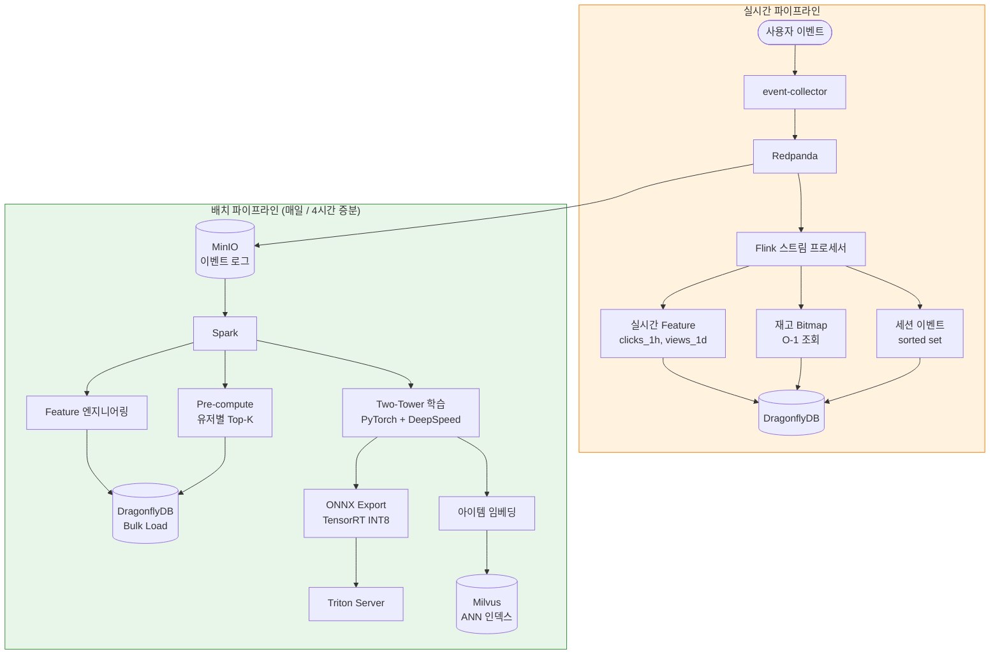
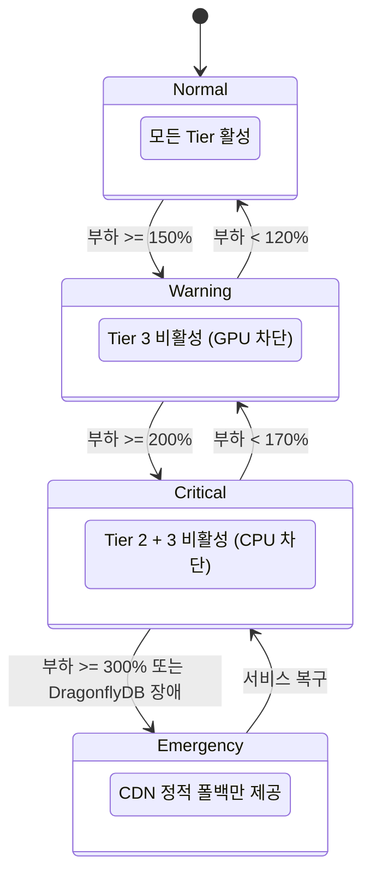

# recsys-pipeline

[English README](README.md)

50M DAU 커머스 서비스를 위한 프로덕션 수준의 추천 시스템 파이프라인.

`docker-compose up` 한 번으로 로컬 실행 가능하고, Kubernetes에서 500K RPS까지 확장되는 클라우드 애그노스틱 레퍼런스 아키텍처.

---

## 왜 이 프로젝트인가?

수천만 사용자를 위한 개인화 엔진을 구축하는 것은 커머스 분야에서 가장 어려운 엔지니어링 과제 중 하나입니다. 대부분의 오픈소스 예제는 토이 데모이거나 독점적인 단편에 불과합니다. 이 프로젝트는 이벤트 수집부터 모델 서빙까지 — 실제 프로덕션 트래픽을 처리할 수 있도록 설계된 **완전하고 실행 가능한 파이프라인**을 제공합니다.

**50M DAU 기준 핵심 수치:**

| 지표 | 값 |
|------|-----|
| 피크 RPS | 500K |
| p99 지연시간 | < 100ms (Tier 1: < 5ms) |
| GPU 추론 RPS | ~4.5K (전체 트래픽의 0.9%) |
| 예상 월 비용 | ~$84K (~1.18억 원) |

---

## 아키텍처

### 1. 시스템 아키텍처 (전체 구성)

각 Plane이 독립적으로 확장되는 **4-Plane** 모델을 따릅니다.


### 2. 3-Tier 추천 흐름

대부분의 사용자에게는 사전 계산된 결과를 제공하고, 캐시 미스 시에만 실시간 추론을 실행합니다.


### 3. 데이터 파이프라인 흐름



### 4. Degradation 상태 머신

시스템은 절대 빈 화면을 보여주지 않습니다. 각 단계에서 가장 비싼 Tier부터 차단하여 핵심 서빙을 보호합니다.



### 5. 배포 아키텍처 (Kubernetes)


---

## 3-Tier 서빙 전략

핵심 인사이트: **모든 요청에 GPU 추론을 실행하지 않는다.** 대부분의 사용자에게는 사전 계산된 결과를 제공하고, 캐시 미스 시에만 실시간 추론을 실행합니다.

> 위 Tier 비율은 CDN을 통과한 150K RPS 기준입니다 (Tier 0 이후).
> 전체 500K RPS 기준: Tier 0=70%, Tier 1=25.5%, Tier 2=3.6%, Tier 3=0.9%.

---

## 프로젝트 구조

```
recsys-pipeline/
├── services/
│   ├── event-collector/          # Go — 이벤트 수집 API (Redpanda 프로듀서)
│   ├── recommendation-api/       # Go — 3-Tier 추천 서빙 (오케스트레이터)
│   ├── ranking-service/          # Python — 모델 서빙 (Triton + ONNX)
│   ├── stream-processor/         # Kotlin — Flink 실시간 Feature + 재고 비트맵
│   ├── batch-processor/          # Python — Spark Feature 엔지니어링 + 사전 계산
│   └── traffic-simulator/        # Go — 부하 테스트 + 샘플 데이터 생성
├── shared/
│   └── go/                       # 공유 Go 타입 (event, keys)
├── ml/
│   ├── models/                   # 모델 학습 코드 (Two-Tower, DCN-V2)
│   ├── notebooks/                # 실험 노트북
│   └── serving/                  # ONNX 변환 + TensorRT INT8 양자화
├── infra/
│   ├── docker-compose.yml        # 로컬 풀스택 (한 명령어)
│   ├── docker/                   # 서비스별 Dockerfile
│   ├── helm/                     # K8s Helm 차트 (dev/staging/production)
│   └── monitoring/               # Prometheus + Grafana 대시보드
├── load-tests/                   # k6 부하 테스트 시나리오
├── configs/                      # 환경별 설정
├── scripts/                      # 유틸리티 스크립트 (verify-e2e, seed data)
├── docs/                         # 아키텍처 문서
├── Makefile                      # 모든 운영 명령어
└── README.md
```

---

## 기술 스택

| 레이어 | 기술 | 용도 |
|--------|------|------|
| **API / 오케스트레이터** | Go 1.23 | event-collector, recommendation-api, traffic-simulator |
| **이벤트 스트리밍** | Redpanda | Kafka 호환, C++ thread-per-core, JVM GC 없음 |
| **캐시 / Feature Store** | DragonflyDB | Redis 호환, 멀티스레드, 5-8배 처리량 |
| **벡터 검색** | Milvus | 분산 ANN (HNSW), 십억 규모 |
| **스트림 처리** | Apache Flink | 진정한 event-at-a-time 스트리밍, 세션 윈도우 |
| **배치 처리** | Apache Spark | PB 규모 Feature 엔지니어링, 모델 학습 데이터 |
| **ML 학습** | PyTorch + DeepSpeed | Two-Tower, DCN-V2 with TorchRec |
| **모델 서빙** | NVIDIA Triton + TensorRT | 동적 배칭, INT8 양자화 |
| **API 게이트웨이** | Envoy | Adaptive concurrency, circuit breaker, 트레이싱 |
| **오브젝트 스토리지** | MinIO | S3 호환, 이벤트 로그 + 모델 아티팩트 |
| **메타데이터** | PostgreSQL | 아이템 카탈로그, 사용자 메타데이터, 실험 설정 |
| **배치 오케스트레이션** | Airflow | 일간 전체 + 4시간 증분 파이프라인 |
| **모니터링** | Prometheus + Grafana | 메트릭, 대시보드, 알림 |
| **트레이싱** | Jaeger (OTLP) | 분산 요청 트레이싱 |
| **알림** | Alertmanager | Degradation 인식 알림 라우팅 |

---

## 아키텍처 의사결정

### 왜 4-Plane 분리인가?

| 접근법 | 장점 | 단점 | 판정 |
|--------|------|------|------|
| **모놀리스** | 단순, 배포 쉬움 | 서빙/학습 리소스 경합 | 1M DAU 한계 |
| **2-Plane** (온라인/오프라인) | 서빙/학습 분리 | 실시간 Feature 없음 | 10M DAU 한계 |
| **4-Plane** (Data/Stream/Batch/Control) | Plane별 독립 확장 | 운영 복잡도 증가 | **50M DAU 필수** |

**결정:** 50M DAU에서는 서빙과 학습이 CPU/GPU/메모리를 놓고 경합합니다. 스트림 처리는 1초 미만의 Feature 신선도를 위해 독립적으로 실행되어야 합니다. 4-Plane 모델은 각 Plane이 자체 리소스 프로파일에 맞춰 오토스케일링할 수 있게 합니다 — 서빙은 CPU, 스트림은 메모리, 배치는 스팟 인스턴스, 컨트롤은 최소 상시 노드에서 확장합니다.

### 왜 3-Tier 서빙인가?

| 접근법 | GPU 사용량 | p99 지연시간 | 월 비용 |
|--------|-----------|-------------|---------|
| 전체 실시간 추론 | 500K RPS GPU | ~100ms+ | $60K+ (GPU만) |
| 사전 계산만 | GPU 0 | < 5ms | 낮지만 데이터 노후화 |
| **3-Tier 하이브리드** | 4.5K RPS (0.9%) | Tier1: 5ms, Tier3: 80ms | **$4.8K (GPU)** |

**결정:** 500K RPS 전체에 GPU 추론을 실행하면 A100 100대 이상($60K+/월)이 필요합니다. 사전 계산이 85%를 커버하고, CPU 리랭킹이 세션 컨텍스트로 12%를 처리하며, GPU는 3%의 콜드스타트/실험 트래픽에만 할당됩니다. 이를 통해 개인화 품질을 유지하면서 GPU 비용을 92% 절감합니다.

### 왜 임베디드 아키텍처 (Fan-out 제거)인가?

| 접근법 | 네트워크 홉 | p99 지연시간 | 장애 모드 |
|--------|-----------|-------------|----------|
| 마이크로서비스 fan-out | 6+ | ~57ms | 단일 서비스 장애 전파 |
| Service mesh (Istio) | 6+ (사이드카 추가) | ~70ms+ | 사이드카 오버헤드 |
| **임베디드** (직접) | 1-2 | ~15ms | DragonflyDB 단일 의존성 |

**결정:** 전통적인 추천 아키텍처는 3-5개 마이크로서비스(Feature Store, 후보 생성, 랭킹, 필터링)로 fan-out합니다. 각 홉마다 ~8-12ms 네트워크 지연이 추가됩니다. Feature 조회, 리랭킹, 필터링을 Go 오케스트레이터에 직접 임베딩함으로써 6+ 홉을 1-2번의 DragonflyDB 읽기로 축소합니다. 트레이드오프는 API 바이너리가 커지는 것이지만, Go의 컴파일 모델은 배포를 단순하게 유지합니다.

---

## 기술 스택 선정 근거

모든 기술은 명시적 비교를 거쳐 선택되었습니다. 아래는 검토된 대안, 각 장점, 그리고 최종 선택 이유입니다.

### 1. API 언어: Go

| 후보 | 처리량 (RPS/core) | p99 지연시간 | 메모리 | 바이너리 배포 | 생태계 |
|------|-------------------|-------------|--------|-------------|--------|
| **Go 1.23** | ~50K | ~2ms | ~30MB | 단일 정적 바이너리 | 강력한 인프라 생태계 |
| Rust | ~60K | ~1.5ms | ~20MB | 단일 바이너리 | 높은 학습 곡선, 느린 반복 |
| Java (Spring) | ~15K | ~10ms | ~500MB+ | JVM + JAR | 성숙하지만 GC로 인한 꼬리 지연 |
| Node.js | ~8K | ~15ms | ~100MB | 런타임 필요 | CPU 바운드 성능 취약 |

**왜 Go인가:** Rust와 비슷한 처리량을 훨씬 빠른 개발 속도로 달성합니다. 단일 바이너리 배포로 JVM/런타임 의존성을 제거합니다. Goroutine 모델은 임베디드 아키텍처(동시 DragonflyDB 읽기 + 로컬 리랭킹)에 자연스럽게 매핑됩니다. Java는 p99에서 GC로 인한 꼬리 지연 스파이크가 발생하여 Tier 1의 <5ms SLA를 위반하기 때문에 탈락했습니다.

### 2. 이벤트 스트리밍: Redpanda vs Kafka

| 기준 | Apache Kafka | **Redpanda** | Pulsar |
|------|-------------|-------------|--------|
| 언어 | Java/Scala (JVM) | C++ (thread-per-core) | Java (JVM) |
| 500K msg/s 필요 노드 | ~50 브로커 | **~12 브로커** | ~40 브로커 |
| 꼬리 지연 (p99) | 10-50ms (GC 일시정지) | **<5ms** (GC 없음) | 15-60ms |
| Kafka API 호환 | 네이티브 | **호환** | 미호환 (자체 프로토콜) |
| 운영 오버헤드 | ZooKeeper/KRaft | **자체 완결** | ZooKeeper + BookKeeper |
| 비용 (50M DAU) | ~$25K/월 | **~$6K/월** | ~$20K/월 |
| 커뮤니티/생태계 | 최대 | 빠른 성장 | 중간 |

**왜 Redpanda인가:** 동일한 API 호환성으로 Kafka 대비 76% 비용 절감. C++ thread-per-core는 p99 스파이크를 유발하는 JVM GC 일시정지를 제거합니다. 자체 완결형 배포(ZooKeeper 불필요)로 운영 복잡도를 줄입니다. 모든 Kafka 클라이언트 라이브러리(franz-go, librdkafka)가 변경 없이 동작합니다. 트레이드오프는 작은 생태계이지만, 우리의 이벤트 스트리밍 사용 사례(고처리량 수집, Flink 소비)에는 Redpanda의 기능이 충분합니다.

### 3. 캐시 / Feature Store: DragonflyDB vs Redis

| 기준 | Redis 7 | **DragonflyDB** | KeyDB | Garnet |
|------|---------|----------------|-------|--------|
| 스레딩 모델 | 싱글스레드 | **멀티스레드 (shared-nothing)** | 멀티스레드 | 멀티스레드 (.NET) |
| 노드당 처리량 (8 CPU) | ~100K ops/s | **500-800K ops/s** | ~200K ops/s | ~300K ops/s |
| 4M ops/s 필요 노드 | ~100 (클러스터) | **~10** | ~40 | ~30 |
| Redis 프로토콜 호환 | 네이티브 | **호환** | 호환 | 호환 |
| 메모리 효율 | 1x | **~0.7x (Dash hash)** | 1x | ~0.8x |
| 영속성 | RDB/AOF | 스냅샷 + WAL | RDB/AOF | RDB/AOF |
| 비용 (50M DAU) | ~$30K/월 | **~$4.5K/월** | ~$12K/월 | ~$9K/월 |

**왜 DragonflyDB인가:** Redis 클러스터 대비 85% 비용 절감. 멀티스레드 shared-nothing 아키텍처로 노드당 5-8배 처리량을 달성하여 100대 대신 10대로 충분합니다. 완전한 Redis 프로토콜 호환으로 코드 변경이 없습니다 — 모든 Go Redis 클라이언트(go-redis, rueidis)가 그대로 동작합니다. Dash hash 테이블로 30% 더 나은 메모리 효율을 제공합니다. 트레이드오프는 극한 규모에서 Redis보다 검증이 덜 되었다는 점이지만, DragonflyDB의 아키텍처는 우리 워크로드(높은 읽기 처리량, Feature Store 패턴)에 근본적으로 더 적합합니다.

### 4. 벡터 검색: Milvus vs 대안

| 기준 | **Milvus** | Qdrant | Weaviate | Pinecone |
|------|-----------|--------|----------|----------|
| 확장성 | **십억 규모 분산** | 수백만 (단일 노드 중심) | 수백만 | 관리형, 십억 |
| 인덱스 타입 | HNSW, IVF, DiskANN, GPU | HNSW | HNSW | 독점 |
| 클라우드 애그노스틱 | **자체 호스팅 가능** | 가능 | 가능 | 불가 (SaaS 전용) |
| 배치 임포트 속도 | **매우 빠름 (bulk insert)** | 보통 | 보통 | API 제한 |
| 쿼리 지연 (10M 벡터) | **<5ms (HNSW)** | <5ms | ~10ms | <10ms |
| 필터링 지원 | **속성 필터링 + ANN** | 페이로드 필터링 | GraphQL | 메타데이터 필터링 |

**왜 Milvus인가:** 1M+ 아이템의 밀집 임베딩에는 십억 규모 분산 ANN이 필요합니다. 자체 호스팅으로 클라우드 애그노스틱을 보장합니다 (Pinecone처럼 벤더 종속 없음). HNSW(낮은 지연)와 IVF_FLAT(높은 리콜) 인덱스 타입을 모두 지원합니다. Qdrant이 차점이었지만 1000만 아이템 이상의 프로덕션 카탈로그에 필요한 분산 확장이 부족합니다.

### 5. 스트림 처리: Flink vs 대안

| 기준 | **Apache Flink** | Spark Structured Streaming | Kafka Streams | Redpanda Transforms |
|------|-----------------|---------------------------|---------------|---------------------|
| 처리 모델 | **진정한 event-at-a-time** | 마이크로 배치 | 레코드 단위 | WASM 함수 |
| Exactly-once | **네이티브** | 체크포인트 기반 | 지원 | At-most-once |
| 세션 윈도우 | **네이티브 지원** | 제한적 | 커스텀 | 미지원 |
| 상태 관리 | **RocksDB, 쿼리 가능** | 인메모리 | RocksDB | 상태 없음 |
| 슬라이딩 윈도우 | **이벤트 시간, 워터마크** | 처리 시간만 | 지원 | 미지원 |
| 처리량 | 매우 높음 | 높음 | 높음 | 제한적 |

**왜 Flink인가:** 정확한 실시간 Feature를 위해 이벤트 시간 시맨틱의 진정한 event-at-a-time 처리가 핵심입니다 (clicks_1h는 정확한 1시간 슬라이딩 윈도우가 필요). 네이티브 세션 윈도우 지원으로 커스텀 코드 없이 세션 이벤트 버퍼링을 처리합니다. RocksDB 상태 백엔드로 OOM 없이 대규모 상태를 지원합니다. Spark Structured Streaming은 마이크로 배치가 100ms+ 지연을 발생시켜 실시간 재고 비트맵 업데이트(<1초 SLA)에 너무 느리기 때문에 탈락했습니다.

### 6. ML 학습: PyTorch vs TensorFlow

| 기준 | **PyTorch** | TensorFlow 2 | JAX |
|------|-----------|--------------|-----|
| 연구 채택률 | **~논문의 80%** | ~15% | ~5% |
| 디버깅 | **Eager 모드, Python 네이티브** | 그래프 모드 복잡 | 함수형, 직관성 부족 |
| 분산 학습 | **DeepSpeed, FSDP** | MultiWorkerMirroredStrategy | pjit |
| ONNX 내보내기 | **네이티브 torch.onnx** | tf2onnx (불안정) | 제한적 |
| TorchRec (추천 모델) | **네이티브 라이브러리** | 동등품 없음 | 동등품 없음 |
| 프로덕션 서빙 | ONNX → Triton | TF Serving | Triton (제한적) |

**왜 PyTorch인가:** 연구 분야 지배적(~새 논문의 80%)이므로 최신 추천 모델 아키텍처(Two-Tower, DCN-V2, DLRM)가 PyTorch 우선으로 발표됩니다. TorchRec이 프로덕션 수준의 추천 프리미티브(임베딩, Feature 처리)를 제공합니다. Triton으로의 ONNX 내보내기가 깔끔한 학습→서빙 경계를 만듭니다. TensorFlow는 연구 채택률 하락과 불안정한 ONNX 변환으로 탈락했습니다.

### 7. 모델 서빙: Triton vs 대안

| 기준 | **NVIDIA Triton** | TF Serving | TorchServe | BentoML |
|------|-------------------|------------|------------|---------|
| 동적 배칭 | **설정 가능** | 제한적 | 지원 | 지원 |
| INT8/FP16 양자화 | **TensorRT 네이티브** | TFLite | 수동 | 프레임워크 의존 |
| 멀티 모델 서빙 | **모델 리포지토리** | 단일 모델 | 복수 | 복수 |
| GPU 활용률 | **CUDA streams, MPS** | 보통 | 보통 | 프레임워크 의존 |
| 처리량 (L4 GPU) | **~600 추론/s (INT8)** | ~200 추론/s | ~300 추론/s | ~250 추론/s |
| gRPC + HTTP | **모두 지원** | 모두 | 모두 | 모두 |

**왜 Triton인가:** 동적 배칭(선호 크기 32/64/128)은 낮은 RPS에서 GPU 활용률에 핵심입니다 — Tier 3은 ~4.5K RPS만 받으므로 GPU 실행 전 요청을 배칭하는 것이 필수적입니다. TensorRT INT8 양자화는 L4 GPU에서 FP32 대비 3배 처리량을 제공하여 GPU 수를 24대에서 8대로 줄입니다. 모델 리포지토리 패턴은 여러 모델 버전의 A/B 테스트를 지원합니다.

### 8. API 게이트웨이: Envoy vs 대안

| 기준 | **Envoy** | NGINX | Kong | Traefik |
|------|----------|-------|------|---------|
| Adaptive concurrency | **그래디언트 기반** | 미지원 | 미지원 | 미지원 |
| Circuit breaking | **엔드포인트별, 설정 가능** | 기본 | 플러그인 | 기본 |
| gRPC 프록시 | **네이티브 (HTTP/2)** | 제한적 | 플러그인 | 지원 |
| 관측성 | **Prometheus + Jaeger 네이티브** | 제한적 | 플러그인 | Prometheus |
| 핫 리로드 | **xDS API (무중단)** | 시그널 기반 | 데이터베이스 | 파일 감시 |
| 확장성 | **WASM 필터** | Lua/njs | Lua 플러그인 | 미들웨어 |

**왜 Envoy인가:** Adaptive concurrency limiting이 백엔드 지연시간에 따라 요청 제한을 자동 조절합니다 — DragonflyDB 지연 스파이크가 Degradation 상태 머신을 트리거할 때 핵심적입니다. 엔드포인트별 circuit breaking으로 Triton 장애가 Tier 3에만 영향을 미치고 전체 API에는 영향을 주지 않습니다. Triton 클라이언트에 필요한 네이티브 gRPC 지원을 제공합니다. NGINX는 adaptive concurrency가 없고 rate limit의 수동 튜닝이 필요하여 탈락했습니다.

### 9. 배치 처리: Spark vs 대안

| 기준 | **Apache Spark** | Dask | Ray | Polars |
|------|-----------------|------|-----|--------|
| 규모 | **PB급, 1000+ 노드** | TB급 | TB급 | 단일 노드 |
| 생태계 | **MLlib, Spark SQL, Delta** | NumPy 호환 | ML 중심 | 빠른 DataFrame |
| 스팟 인스턴스 지원 | **네이티브 (동적 할당)** | 수동 | 오토스케일러 | 해당 없음 |
| Feature 엔지니어링 | **Spark SQL + UDF** | Pandas API | 커스텀 | 빠르지만 단일 노드 |
| Airflow 연동 | **SparkSubmitOperator** | DaskOperator | RayOperator | PythonOperator |

**왜 Spark인가:** 이벤트 로그에 대한 PB급 Feature 엔지니어링이 주 사용 사례입니다. Spark SQL은 유지보수가 쉬운 선언적 집계(사용자/아이템 Feature)를 제공합니다. 스팟 인스턴스의 동적 리소스 할당으로 배치 처리 비용을 ~60% 절감합니다. Polars는 단일 노드 워크로드에서 더 빠르지만 우리 데이터 볼륨에 맞는 클러스터 분산이 불가능합니다.

### 10. 모니터링 & 관측성

| 기준 | **Prometheus + Grafana** | Datadog | New Relic | InfluxDB + Chronograf |
|------|------------------------|---------|-----------|----------------------|
| 비용 (50M DAU 메트릭) | **무료 (자체 호스팅)** | $50K+/월 | $40K+/월 | 무료 (자체 호스팅) |
| Kubernetes 네이티브 | **ServiceMonitor CRD** | 에이전트 기반 | 에이전트 기반 | 수동 |
| 알림 관리자 | **Alertmanager (네이티브)** | 내장 | 내장 | Kapacitor |
| 커스텀 메트릭 | **클라이언트 라이브러리 (Go, Py)** | DogStatsD | Agent API | Line protocol |
| 대시보드 | **Grafana (최고 수준)** | 좋음 | 좋음 | Chronograf (제한적) |
| PromQL | **네이티브** | PromQL 호환 | NRQL | InfluxQL |

**왜 Prometheus + Grafana인가:** 규모에서 라이선스 비용 제로 — Datadog은 50M DAU에서 메트릭만으로 $50K+/월입니다. ServiceMonitor CRD를 통한 Kubernetes 네이티브 서비스 디스커버리. Grafana의 대시보드 생태계가 DragonflyDB, Redpanda, Flink용 사전 구축 패널을 제공합니다. Alertmanager가 Degradation 상태 머신과 연동하여 자동 Tier 차단을 지원합니다.

---

## 핵심 설계 결정

### 1. Fan-out 제거

`recommendation-api`가 Feature 조회, 리랭킹, 필터링 로직을 직접 임베딩합니다:

```
전통적: api -> 네트워크 -> feature-store -> 네트워크 -> 응답     (x3 서비스 = 6 홉)
본 설계: api -> DragonflyDB 읽기 + 로컬 리랭킹 + 비트맵 필터  (1-2 홉)
```

결과: Tier 1 기준 p99가 ~57ms에서 ~15ms로 감소.

### 2. 실시간 재고를 위한 Stock Bitmap

```
재고 이벤트 -> Redpanda -> Flink -> DragonflyDB 비트맵 업데이트 (< 1초)
쿼리 시간:  GETBIT stock:bitmap {item_id}  ->  O(1), < 0.1ms
```

전통적 접근법은 재고 확인에 데이터베이스 조인이나 API 호출을 사용하여 아이템당 5-10ms가 추가됩니다. 비트맵 접근법은 100개 아이템 재고 확인을 단일 O(1) GETBIT 연산으로 축소합니다.

### 3. 점진적 Degradation 체인

```
Normal         ->  Tier 0 + 1 + 2 + 3
Warning (150%) ->  Tier 3 비활성 (GPU 차단)
Critical(200%) ->  Tier 2 + 3 비활성 (CPU 차단)
Emergency      ->  CDN 정적 폴백만
```

시스템은 절대 빈 화면을 보여주지 않습니다. 각 Degradation 단계에서 가장 비싼 Tier부터 차단(GPU → CPU → 캐시)하여 개인화 품질을 희생하더라도 사용자 경험을 보호합니다.

### 4. 비용 최적화

| 컴포넌트 | 이전 (기존 방식) | 이후 (본 아키텍처) | 절감 | 핵심 변경 |
|----------|----------------|-------------------|------|----------|
| 메시지 브로커 | Kafka 50노드 ($25K) | Redpanda 12노드 ($6K) | -76% | C++ thread-per-core, JVM 없음 |
| 캐시 | Redis 100노드 ($30K) | DragonflyDB 10노드 ($4.5K) | -85% | 멀티스레드, 노드당 5-8배 |
| GPU 추론 | A100x20 ($60K) | L4 INT8x8 ($4.8K) | -92% | 3-Tier 서빙, 0.9% GPU 트래픽 |
| 벡터 검색 | Milvus 50노드 ($20K) | Milvus 8노드 ($3.2K) | -84% | 사전 계산으로 ANN 쿼리 감소 |
| **전체 인프라** | **$285K/월** | **$84K/월** | **-71%** | |

---

## 빠른 시작

### 사전 요구사항

- Docker & Docker Compose v2
- Go 1.23+
- 32GB+ RAM (16GB는 서비스 축소 시 가능)
- GPU 선택 사항 (Triton CPU 폴백 가능)

### 로컬 실행

```bash
# 클론
git clone https://github.com/YOUR_USERNAME/recsys-pipeline.git
cd recsys-pipeline

# 모든 서비스 시작
make up

# 샘플 데이터 생성 (100K 사용자, 1M 아이템)
make seed-data

# 헬스 체크
make health-check

# 샘플 트래픽 생성
make simulate-traffic

# 모니터링 대시보드 열기
open http://localhost:3000  # Grafana
```

### E2E 검증

```bash
# 전체 E2E 테스트 (스택 시작, 시딩, 전체 엔드포인트 테스트)
make verify-e2e
```

### Makefile 타겟

| 타겟 | 설명 |
|------|------|
| `make up` | docker-compose로 모든 서비스 시작 |
| `make down` | 중지 및 볼륨 제거 |
| `make logs` | docker-compose 로그 추적 |
| `make seed-data` | 샘플 아이템/사용자 생성 |
| `make health-check` | 서비스 헬스 엔드포인트 확인 |
| `make simulate-traffic` | 트래픽 시뮬레이터 실행 |
| `make verify-e2e` | 전체 E2E 검증 |
| `make test` | 전체 Go 유닛 테스트 실행 |
| `make bench-local` | k6 부하 테스트 실행 |
| `make docker-build-all` | 모든 Docker 이미지 빌드 |

### 부하 테스트 실행

```bash
# 단일 노드 벤치마크
make bench-local

# 분산 부하 테스트 (K8s 필요)
make bench-k6 RPS=100000

# 카오스 엔지니어링 테스트
make chaos-test
```

### 서비스 엔드포인트 (로컬)

| 서비스 | URL |
|--------|-----|
| event-collector | http://localhost:8080 |
| recommendation-api | http://localhost:8090 |
| Redpanda Console | http://localhost:8088 |
| Grafana | http://localhost:3000 |
| Prometheus | http://localhost:9090 |
| Jaeger | http://localhost:16686 |
| Airflow | http://localhost:8085 |
| MinIO Console | http://localhost:9002 |
| Milvus | localhost:19530 |

---

## 검증

### 1단계: 단일 노드 벤치마크

| 컴포넌트 | 목표 | 도구 |
|----------|------|------|
| event-collector | 인스턴스당 10K RPS | wrk, hey |
| DragonflyDB | 1M+ ops/sec | redis-benchmark |
| ONNX Runtime INT8 | 추론당 < 10ms | Triton perf_analyzer |
| recommendation-api E2E | Tier1 < 5ms, Tier2 < 20ms | k6 |

### 2단계: 분산 부하 테스트

- 램프: 1K -> 10K -> 50K -> 100K RPS
- 각 레벨 5분 유지
- 측정: p50/p95/p99 지연시간, 에러율, Tier 분포

### 3단계: 카오스 엔지니어링

| 테스트 케이스 | 주입 | 기대 결과 |
|--------------|------|----------|
| TC-01 | DragonflyDB 마스터 Kill | 페일오버 < 3초, 요청 손실 없음 |
| TC-02 | Triton GPU 전체 다운 | Tier 1 자동 폴백 |
| TC-03 | Redpanda 3 브로커 다운 | 이벤트 손실 없음 (RF=3) |
| TC-04 | 200ms 네트워크 지연 | Circuit breaker 트리거 |
| TC-05 | 10x 트래픽 스파이크 | Rate limiter가 기존 사용자 보호 |
| TC-06 | 10K 아이템/초 품절 | 비트맵 업데이트 < 1초 |

---

## 프로덕션 배포

```bash
# 이미지 빌드 및 푸시
make docker-build-all
make docker-push-all REGISTRY=your-registry.io

# K8s 배포
helm install recsys ./infra/helm \
  -f ./infra/helm/values/production.yaml \
  --namespace recsys-prod

# 검증
kubectl get pods -n recsys-prod
make health-check-k8s
```

### 프로덕션 규모 (50M DAU)

| 서비스 | Pod 수 | 리소스 |
|--------|--------|--------|
| event-collector | 50 | 2 CPU, 4GB |
| stream-processor (Flink) | 25 TM | 4 CPU, 8GB |
| recommendation-api | 250 | 4 CPU, 8GB |
| ranking-service (Triton) | 8 | L4 GPU, 16GB |
| DragonflyDB | 10 노드 | 8 CPU, 64GB |
| Redpanda | 12 브로커 | 8 CPU, 32GB |
| Milvus | 8 노드 | 8 CPU, 32GB |

---

## 로드맵

- [x] 아키텍처 설계
- [x] 핵심 서비스 구현 (event-collector, recommendation-api)
- [x] 3-Tier 추천 서빙 (Tier 1 + 2 + 3)
- [x] Circuit breaker 및 Prometheus 메트릭
- [x] Flink 스트림 프로세서 (실시간 Feature + 재고 비트맵)
- [x] 배치 프로세서 (Spark Feature + 임베딩 + 사전 계산)
- [x] ML 모델 (Two-Tower + DCN-V2 with ONNX export)
- [x] 랭킹 서비스 (Triton + ONNX)
- [x] docker-compose 로컬 스택
- [x] K8s Helm 차트 (dev/staging/production)
- [x] k6 부하 테스트 스위트
- [x] 카오스 엔지니어링 테스트 (Chaos Mesh)
- [x] 모니터링 대시보드 (Prometheus + Grafana)
- [x] E2E 검증 스크립트
- [ ] 엣지 컴퓨팅 (Cloudflare Workers)
- [ ] Feature Store 계층화 (Hot/Warm/Cold)
- [ ] 모델 경량화 (GPU -> CPU)
- [ ] 멀티 리전 Active-Active

---

## 라이선스

MIT
