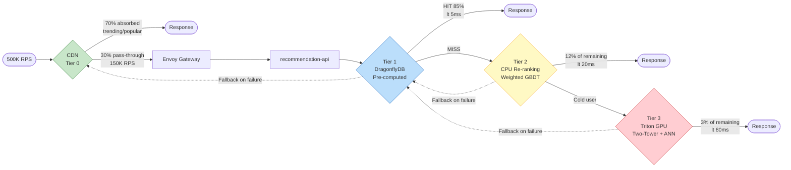

# recsys-pipeline

Production-grade recommendation system pipeline for 50M DAU commerce services.

A cloud-agnostic reference architecture that runs locally with `docker-compose up` and scales to 500K RPS on Kubernetes.

---

## Why This Project?

Building a personalization engine for tens of millions of users is one of the hardest engineering challenges in commerce. Most open-source examples are either toy demos or proprietary fragments. This project provides a **complete, runnable pipeline** — from event ingestion to model serving — designed to handle real production traffic.

**Key numbers at 50M DAU:**

| Metric | Value |
|--------|-------|
| Peak RPS | 500K |
| p99 Latency | < 100ms (Tier 1: < 5ms) |
| GPU Inference RPS | ~4.5K (0.9% of traffic) |
| Estimated Monthly Cost | ~$84K (~1.18억 원) |

---

## Architecture

### 1. System Architecture (High-Level)

The system follows a **4-Plane** model where each plane scales independently.


### 2. 3-Tier Recommendation Flow

Pre-compute results for most users. Reserve real-time inference for cache misses only.



### 3. Data Pipeline Flow


### 4. Degradation State Machine

The system never shows an empty screen. Each level sheds a tier to protect core serving.

```mermaid
stateDiagram-v2
    [*] --> Normal

    Normal --> Warning : Load >= 150%
    Warning --> Normal : Load < 120%
    Warning --> Critical : Load >= 200%
    Critical --> Warning : Load < 170%
    Critical --> Emergency : Load >= 300% OR DragonflyDB down
    Emergency --> Critical : Services recovered

    state Normal {
        [*] : All tiers active
        note right of Normal
            Tier 0 + 1 + 2 + 3
            Full personalization
        end note
    }

    state Warning {
        [*] : Tier 3 disabled
        note right of Warning
            GPU inference shed
            Tier 0 + 1 + 2 only
        end note
    }

    state Critical {
        [*] : Tier 2 + 3 disabled
        note right of Critical
            CPU re-ranking shed
            Tier 0 + 1 only (cache)
        end note
    }

    state Emergency {
        [*] : CDN static fallback
        note right of Emergency
            All backend tiers shed
            Serve cached popular lists
        end note
    }
```

### 5. Deployment Architecture (Kubernetes)


---

## 3-Tier Serving Strategy

The core insight: **don't run GPU inference on every request.** Pre-compute results for most users, reserve real-time inference for cache misses only.

> Tier percentages above are of the 150K RPS that pass CDN (post-Tier 0).
> Of total 500K RPS: Tier 0=70%, Tier 1=25.5%, Tier 2=3.6%, Tier 3=0.9%.

---

## Project Structure

```
recsys-pipeline/
├── services/
│   ├── event-collector/          # Go — Event ingestion API (Redpanda producer)
│   ├── recommendation-api/       # Go — 3-tier recommendation serving (orchestrator)
│   ├── ranking-service/          # Python — Model serving (Triton + ONNX)
│   ├── stream-processor/         # Python — Flink real-time features + stock bitmap
│   ├── batch-processor/          # Python — Spark feature engineering + pre-compute
│   └── traffic-simulator/        # Go — Load testing + sample data generation
├── shared/
│   └── go/                       # Shared Go types (event, keys)
├── ml/
│   ├── models/                   # Model training code (Two-Tower, DCN-V2)
│   ├── notebooks/                # Experimentation notebooks
│   └── serving/                  # ONNX conversion + TensorRT INT8 quantization
├── infra/
│   ├── docker-compose.yml        # Local full-stack (one command)
│   ├── docker/                   # Per-service Dockerfiles
│   ├── helm/                     # K8s Helm charts (dev/staging/production)
│   └── monitoring/               # Prometheus + Grafana dashboards
├── load-tests/                   # k6 load test scenarios
├── configs/                      # Environment-specific configs
├── scripts/                      # Utility scripts (verify-e2e, seed data)
├── docs/                         # Architecture documentation
├── Makefile                      # All operational commands
└── README.md
```

---

## Tech Stack

| Layer | Technology | Purpose |
|-------|-----------|---------|
| **API / Orchestrator** | Go 1.23 | event-collector, recommendation-api, traffic-simulator |
| **Event Streaming** | Redpanda | Kafka-compatible, C++ thread-per-core, no JVM GC |
| **Cache / Feature Store** | DragonflyDB | Redis-compatible, multi-threaded, 5-8x throughput |
| **Vector Search** | Milvus | Distributed ANN (HNSW), billion-scale |
| **Stream Processing** | Apache Flink | True event-at-a-time streaming, session windows |
| **Batch Processing** | Apache Spark | PB-scale feature engineering, model training data |
| **ML Training** | PyTorch + DeepSpeed | Two-Tower, DCN-V2 with TorchRec |
| **Model Serving** | NVIDIA Triton + TensorRT | Dynamic batching, INT8 quantization |
| **API Gateway** | Envoy | Adaptive concurrency, circuit breaker, tracing |
| **Object Storage** | MinIO | S3-compatible, event logs + model artifacts |
| **Metadata** | PostgreSQL | Item catalog, user metadata, experiment config |
| **Batch Orchestration** | Airflow | Daily full + 4-hour incremental pipelines |
| **Monitoring** | Prometheus + Grafana | Metrics, dashboards, alerting |
| **Tracing** | Jaeger (OTLP) | Distributed request tracing |
| **Alerting** | Alertmanager | Degradation-aware alert routing |

---

## Architecture Decisions

### Why 4-Plane Separation?

| Approach | Pros | Cons | Verdict |
|----------|------|------|---------|
| **Monolith** | Simple, easy deploy | Serving/training resource contention | 1M DAU max |
| **2-Plane** (Online/Offline) | Serving/training separated | No real-time features | 10M DAU max |
| **4-Plane** (Data/Stream/Batch/Control) | Independent scaling per plane | Higher operational complexity | **50M DAU required** |

### Why 3-Tier Serving?

| Approach | GPU Usage | p99 Latency | Monthly Cost |
|----------|-----------|-------------|-------------|
| All real-time inference | 500K RPS on GPU | ~100ms+ | $60K+ (GPU only) |
| Pre-compute only | 0 GPU | < 5ms | Low, but stale |
| **3-Tier hybrid** | 4.5K RPS (0.9%) | Tier1: 5ms, Tier3: 80ms | **$4.8K (GPU)** |

### Why Embedded Architecture (Fan-out Elimination)?

| Approach | Network Hops | p99 Latency | Failure Mode |
|----------|-------------|-------------|--------------|
| Microservice fan-out | 6+ | ~57ms | Single service failure cascades |
| Service mesh (Istio) | 6+ (sidecar added) | ~70ms+ | Sidecar overhead |
| **Embedded** (direct) | 1-2 | ~15ms | DragonflyDB single dependency |

---

## Key Design Decisions

### 1. Fan-out Elimination

The `recommendation-api` embeds feature lookup, re-ranking, and filtering logic directly:

```
Traditional: api -> network -> feature-store -> network -> response     (x3 services = 6 hops)
Ours:        api -> DragonflyDB read + local re-rank + bitmap filter  (1-2 hops)
```

Result: p99 drops from ~57ms to ~15ms for Tier 1.

### 2. Stock Bitmap for Real-time Inventory

```
Stock event -> Redpanda -> Flink -> DragonflyDB bitmap update (< 1 second)
Query time:  GETBIT stock:bitmap {item_id}  ->  O(1), < 0.1ms
```

### 3. Graceful Degradation Chain

```
Normal         ->  Tier 0 + 1 + 2 + 3
Warning (150%) ->  Tier 3 disabled (GPU shed)
Critical(200%) ->  Tier 2 + 3 disabled (CPU shed)
Emergency      ->  CDN static fallback only
```

### 4. Cost Optimization

| Component | Before | After | Savings |
|-----------|--------|-------|---------|
| Message Broker | Kafka 50 nodes ($25K) | Redpanda 12 nodes ($6K) | -76% |
| Cache | Redis 100 nodes ($30K) | DragonflyDB 10 nodes ($4.5K) | -85% |
| GPU Inference | A100x20 ($60K) | L4 INT8x8 ($4.8K) | -92% |
| Vector Search | Milvus 50 nodes ($20K) | Milvus 8 nodes ($3.2K) | -84% |
| **Total infra** | **$285K/mo** | **$84K/mo** | **-71%** |

---

## Quick Start

### Prerequisites

- Docker & Docker Compose v2
- Go 1.23+
- 32GB+ RAM (16GB may work with reduced services)
- GPU optional (CPU fallback for Triton)

### Run Locally

```bash
# Clone
git clone https://github.com/YOUR_USERNAME/recsys-pipeline.git
cd recsys-pipeline

# Start all services
make up

# Generate sample data (100K users, 1M items)
make seed-data

# Check health
make health-check

# Generate sample traffic
make simulate-traffic

# Open monitoring dashboard
open http://localhost:3000  # Grafana
```

### E2E Verification

```bash
# Full end-to-end test (start stack, seed, test all endpoints)
make verify-e2e
```

### Makefile Targets

| Target | Description |
|--------|-------------|
| `make up` | Start all services via docker-compose |
| `make down` | Stop and remove volumes |
| `make logs` | Tail docker-compose logs |
| `make seed-data` | Generate sample items/users |
| `make health-check` | Check service health endpoints |
| `make simulate-traffic` | Run traffic simulator |
| `make verify-e2e` | Full end-to-end verification |
| `make test` | Run all Go unit tests |
| `make bench-local` | Run k6 load test |
| `make docker-build-all` | Build all Docker images |

### Run Load Tests

```bash
# Single-node benchmark
make bench-local

# Distributed load test (requires K8s)
make bench-k6 RPS=100000

# Chaos engineering tests
make chaos-test
```

### Service Endpoints (Local)

| Service | URL |
|---------|-----|
| event-collector | http://localhost:8080 |
| recommendation-api | http://localhost:8090 |
| Redpanda Console | http://localhost:8088 |
| Grafana | http://localhost:3000 |
| Prometheus | http://localhost:9090 |
| Jaeger | http://localhost:16686 |
| Airflow | http://localhost:8085 |
| MinIO Console | http://localhost:9002 |
| Milvus | localhost:19530 |

---

## Verification

### Stage 1: Single-Node Benchmark

| Component | Target | Tool |
|-----------|--------|------|
| event-collector | 10K RPS / instance | wrk, hey |
| DragonflyDB | 1M+ ops/sec | redis-benchmark |
| ONNX Runtime INT8 | < 10ms / inference | Triton perf_analyzer |
| recommendation-api E2E | Tier1 < 5ms, Tier2 < 20ms | k6 |

### Stage 2: Distributed Load Test

- Ramp: 1K -> 10K -> 50K -> 100K RPS
- Hold each level for 5 minutes
- Measure: p50/p95/p99 latency, error rate, tier distribution

### Stage 3: Chaos Engineering

| Test Case | Injection | Expected |
|-----------|----------|----------|
| TC-01 | DragonflyDB master kill | Failover < 3s, zero request loss |
| TC-02 | Triton GPU all down | Auto-fallback to Tier 1 |
| TC-03 | Redpanda 3 brokers down | Zero event loss (RF=3) |
| TC-04 | 200ms network latency | Circuit breaker triggers |
| TC-05 | 10x traffic spike | Rate limiter protects existing users |
| TC-06 | 10K items/sec stock-out | Bitmap update < 1s |

---

## Production Deployment

```bash
# Build and push images
make docker-build-all
make docker-push-all REGISTRY=your-registry.io

# Deploy to K8s
helm install recsys ./infra/helm \
  -f ./infra/helm/values/production.yaml \
  --namespace recsys-prod

# Verify
kubectl get pods -n recsys-prod
make health-check-k8s
```

### Production Scale (50M DAU)

| Service | Pods | Resource |
|---------|------|----------|
| event-collector | 50 | 2 CPU, 4GB |
| stream-processor (Flink) | 25 TM | 4 CPU, 8GB |
| recommendation-api | 250 | 4 CPU, 8GB |
| ranking-service (Triton) | 8 | L4 GPU, 16GB |
| DragonflyDB | 10 nodes | 8 CPU, 64GB |
| Redpanda | 12 brokers | 8 CPU, 32GB |
| Milvus | 8 nodes | 8 CPU, 32GB |

---

## Roadmap

- [x] Architecture design
- [x] Core services implementation (event-collector, recommendation-api)
- [x] 3-tier recommendation serving (Tier 1 + 2 + 3)
- [x] Circuit breaker and Prometheus metrics
- [x] Flink stream processor (real-time features + stock bitmap)
- [x] Batch processor (Spark features + embeddings + pre-compute)
- [x] ML models (Two-Tower + DCN-V2 with ONNX export)
- [x] Ranking service (Triton + ONNX)
- [x] docker-compose local stack
- [x] Helm charts for K8s (dev/staging/production)
- [x] k6 load testing suite
- [x] Chaos engineering tests (Chaos Mesh)
- [x] Monitoring dashboards (Prometheus + Grafana)
- [x] E2E verification script
- [ ] Edge computing (Cloudflare Workers)
- [ ] Feature store tiering (Hot/Warm/Cold)
- [ ] Model distillation (GPU -> CPU)
- [ ] Multi-region Active-Active

---

## License

MIT
